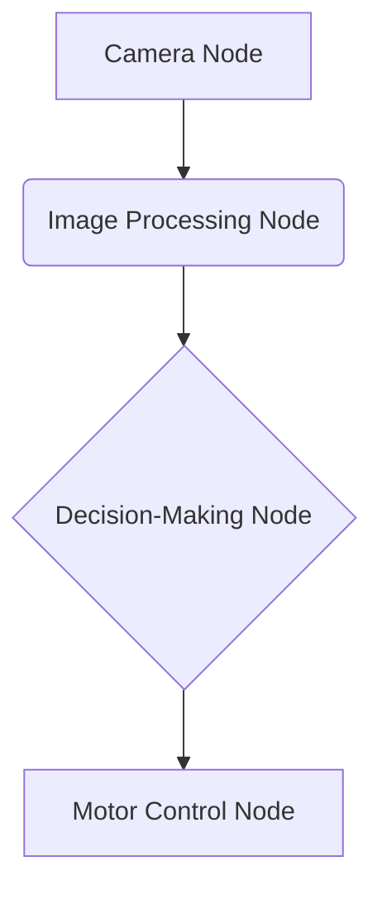
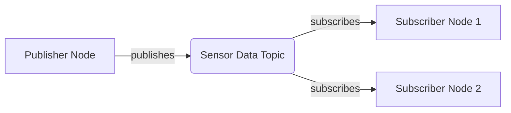
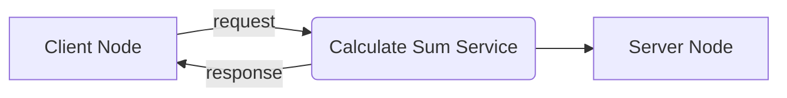
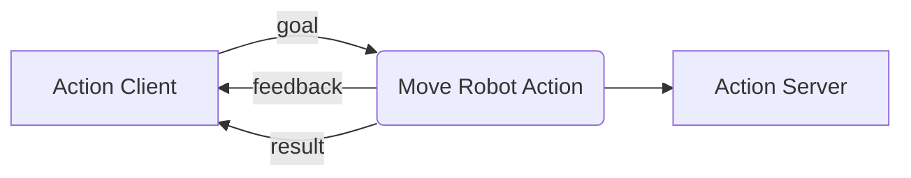

# Understanding ROS 2 Architecture and Core Concepts

This chapter introduces the fundamental concepts of ROS 2, focusing on its distributed architecture, core communication mechanisms, and the role of DDS middleware. By the end of this chapter, you will be able to diagram a simple ROS 2 system, identify its components, and explain how they communicate.

## ROS 2 Distributed Architecture

Unlike ROS 1, ROS 2 features a distributed architecture with no central master. This design enhances scalability, reliability, and security, making it suitable for a wider range of robotic applications, from single-robot systems to large-scale deployments.

### DDS (Data Distribution Service) Middleware

ROS 2 leverages the Data Distribution Service (DDS) as its primary communication middleware. DDS is an open international standard for real-time systems that enables efficient, reliable, and secure data exchange between distributed applications. It handles discovery, serialization, and transport, allowing ROS 2 nodes to communicate seamlessly without a central server.

## Core ROS 2 Concepts

ROS 2 organizes its functionalities around several core concepts that facilitate modular and robust robot software development.

### Nodes

A **node** is an executable process that performs a specific task within the ROS 2 computational graph. Nodes are modular and can be written in various programming languages (e.g., Python, C++). Examples include a camera driver node, a motor controller node, or a navigation algorithm node.

### Topics (Publish-Subscribe)

**Topics** are named buses over which nodes exchange messages using a publish-subscribe communication model. A node **publishes** messages to a topic, and other nodes **subscribe** to that topic to receive the messages. This asynchronous, one-to-many communication pattern is ideal for streaming data, such as sensor readings or robot state updates.

### Services (Request-Response)

**Services** provide a synchronous request-response communication mechanism between nodes. A **service client** sends a request to a **service server**, which processes the request and returns a response. This is useful for operations that require an immediate result, like querying a robot's current pose or triggering a specific action.

### Actions (Long-Running with Feedback)

**Actions** are designed for long-running tasks that may require periodic feedback and the ability to be preempted. An **action client** sends a goal to an **action server**, which executes the task and provides continuous feedback on its progress. The client can also cancel the goal if needed. This is commonly used for tasks like navigating to a specific location or manipulating an object.

### Computational Graph

The **computational graph** is a network of all the ROS 2 nodes, topics, services, and actions running in a system. It represents the data flow and communication pathways, providing a high-level overview of how different components interact to achieve a robot's overall functionality.

### ROS 2 Humble Hawksbill LTS

**ROS 2 Humble Hawksbill** is a Long Term Support (LTS) release of ROS 2, providing extended maintenance and support until 2027. It is a stable and widely adopted distribution, compatible with Ubuntu 22.04 LTS, making it an excellent choice for developing robust and production-ready robotic applications.

## ROS 2 Humble Installation Instructions

To install ROS 2 Humble Hawksbill, **we recommend following the official documentation for Ubuntu 22.04 LTS**, as this is the standard distribution for this course:

*   **Ubuntu (recommended)**: [ROS 2 Humble Hawksbill Installation on Ubuntu](https://docs.ros.org/en/humble/Installation/Ubuntu-Install-Debians.html)
*   **Windows**: [ROS 2 Humble Hawksbill Installation on Windows](https://docs.ros.org/en/humble/Installation/Windows-Install-Binary.html)
*   **macOS**: [ROS 2 Humble Hawksbill Installation on macOS](https://docs.ros.org/en/humble/Installation/macOS-Install-Binary.html)

## ROS 2 CLI Tools

ROS 2 provides a powerful set of command-line interface (CLI) tools for interacting with and debugging ROS 2 systems. Some commonly used tools include:

*   `ros2 run`: Run an executable from a package.
*   `ros2 topic`: Inspect topics (e.g., `ros2 topic list`, `ros2 topic echo <topic_name>`).
*   `ros2 node`: Inspect nodes (e.g., `ros2 node list`, `ros2 node info <node_name>`).
*   `ros2 service`: Inspect services (e.g., `ros2 service list`, `ros2 service call <service_name> <type> <args>`).
*   `ros2 param`: Inspect parameters (e.g., `ros2 param list`, `ros2 param get <node_name> <param_name>`).
*   `ros2 launch`: Run a launch file.

## QoS (Quality of Service) Policies

**QoS (Quality of Service) policies** in ROS 2 allow developers to configure the reliability, durability, and latency characteristics of topic communication. These policies ensure that data is delivered according to the application's specific requirements, especially in real-time and safety-critical systems. Key QoS policies include:

*   **Reliability**: Guarantees message delivery (or not).
*   **Durability**: Specifies if messages persist for late-joining subscribers.
*   **History**: Configures how many messages are stored.
*   **Liveliness**: Detects if publishers are active.
*   **Deadline**: Sets a maximum expected time between messages.

Understanding and configuring QoS policies is crucial for building robust and predictable ROS 2 applications.