# Chapter 10: Sim-to-Real Transfer

## Learning Objectives

By the end of this chapter, you will be able to:

- **Analyze** sources of the reality gap between simulation and real robots
- **Implement** domain randomization to create robust policies
- **Perform** system identification to calibrate simulation parameters  
- **Apply** progressive transfer learning from simulation to reality
- **Validate** sim-to-real transfer with quantitative metrics
- **Design** experiments to minimize the reality gap
- **Deploy** simulation-trained AI to real humanoid robots

**Prerequisites**: Chapters 6-9 (Complete Module 2)  
**Estimated Time**: 60 minutes

---

## The Reality Gap Problem

**Reality Gap**: The difference between simulated and real-world robot behavior.

### Why the Gap Exists

No simulator perfectly models reality due to:

1. **Physics Approximations**
   - Contact dynamics (friction, bouncing)
   - Deformable objects (cloth, soft materials)
   - Fluid dynamics (air resistance, water)

2. **Sensor Discrepancies**
   - Noise patterns don't match exactly
   - Lighting conditions impossible to replicate
   - Calibration errors

3. **Actuator Differences**
   - Motor backlash and dead zones
   - Temperature-dependent performance
   - Battery voltage variations

4. **Environmental Factors**
   - Surface irregularities (no floor is perfectly flat)
   - Unexpected obstacles
   - Human behavior


:::warning The Challenge
A policy that works perfectly in simulation might **completely fail** on a real robot if the reality gap isn't addressed.
:::

---

## Domain Randomization: The Solution

**Domain Randomization**: Vary simulation parameters during training so the learned policy becomes robust to real-world variations.

### Core Idea

```mermaid
graph LR
    A[Training Episode 1:<br/>Friction=0.5] --> D[Robust Policy]
    B[Training Episode 2:<br/>Friction=0.8] --> D
    C[Training Episode 3:<br/>Friction=1.2] --> D
    D --> E[Real World:<br/>Friction=0.7]
    E --> F[Success! ✅]
    
    style D fill:#90EE90
    style F fill:#FFD700
```



**If trained policy works across randomized simulations, it will likely work in reality.**

---

## Types of Domain Randomization

### 1. Visual Randomization

**What to Randomize:**
- Textures (floor, walls, objects)
- Lighting (intensity, color, position)
- Camera parameters (exposure, distortion)
- Background clutter

**Gazebo Example: Random Lighting**

```python
import random
from gazebo_msgs.srv import SetLightProperties
from std_msgs.msg import ColorRGBA

class LightingRandomizer(Node):
    def __init__(self):
        super().__init__('lighting_randomizer')
        self.client = self.create_client(SetLightProperties, '/world/default/set_light')
        
    def randomize_light(self):
        # Random intensity (500-50000 Lux)
        intensity = random.uniform(500, 50000)
        
        # Random color temperature
        temp = random.uniform(2700, 6500)  # Warm to cool
        color = self.temperature_to_rgb(temp)
        
        # Call Gazebo service
        req = SetLightProperties.Request()
        req.light_name = 'sun'
        req.diffuse = ColorRGBA(r=color[0], g=color[1], b=color[2], a=1.0)
        req.attenuation_constant = intensity
        
        self.client.call_async(req)
        
    def temperature_to_rgb(self, kelvin):
        # Simplified color temperature conversion
        if kelvin < 3000:
            return [1.0, 0.8, 0.6]  # Warm
        elif kelvin < 5000:
            return [1.0, 1.0, 0.9]  # Neutral
        else:
            return [0.8, 0.9, 1.0]  # Cool
```

---

**Unity Example: Texture Randomization**

```csharp
using UnityEngine;

public class TextureRandomizer : MonoBehaviour
{
    public Material[] floorMaterials;  // Array of different floor textures
    public Renderer floorRenderer;
    
    void OnEpisodeBegin()
    {
        // Randomly select floor texture
        int randomIndex = Random.Range(0, floorMaterials.Length);
        floorRenderer.material = floorMaterials[randomIndex];
        
        Debug.Log($"Randomized floor texture: {floorMaterials[randomIndex].name}");
    }
}
```

---

### 2. Physics Randomization

**What to Randomize:**
- Friction coefficients
- Mass and inertia
- Joint damping and limits
- Gravity (if testing on moon, Mars, etc.)

**Gazebo Physics Randomization:**

```python
import random
from gazebo_msgs.srv import SetPhysicsProperties

class PhysicsRandomizer(Node):
    def __init__(self):
        super().__init__('physics_randomizer')
        self.client = self.create_client(SetPhysicsProperties, '/set_physics_properties')
    
    def randomize_physics(self):
        req = SetPhysicsProperties.Request()
        
        # Randomize gravity (Earth ±10%)
        gravity_multiplier = random.uniform(0.9, 1.1)
        req.gravity.z = -9.81 * gravity_multiplier
        
        # Randomize physics timestep
        req.time_step = random.uniform(0.0005, 0.002)
        
        # Randomize solver iterations
        req.ode_config.sor_pgs_iters = random.randint(30, 100)
        
        self.client.call_async(req)
        self.get_logger().info(f'Randomized gravity: {req.gravity.z:.2f} m/s²')
```

---

**Friction Randomization in URDF:**

```xml
<!-- Gazebo material properties with randomization -->
<gazebo reference="foot_link">
  <mu1>0.8</mu1>  <!-- Baseline friction -->
  <mu2>0.8</mu2>
  <kp>1000000.0</kp>
  <kd>100.0</kd>
</gazebo>
```

Then randomize at runtime:

```python
from gazebo_msgs.srv import SetLinkProperties

def randomize_friction(self, link_name):
    req = SetLinkProperties.Request()
    req.link_name = link_name
    
    # Randomize friction ±30%
    req.surface.friction.mu = random.uniform(0.56, 1.04)  # 0.8 ±30%
    req.surface.friction.mu2 = req.surface.friction.mu
    
    self.friction_client.call_async(req)
```

---

### 3. Sensor Randomization

**What to Randomize:**
- Camera noise, blur, exposure
- LiDAR dropouts, noise
- IMU bias and drift

**Camera Noise Randomization (Unity):**

```csharp
using UnityEngine.Rendering.PostProcessing;

public class CameraNoiseRandomizer : MonoBehaviour
{
    PostProcessVolume volume;
    Grain grain;
    
    void Start()
    {
        volume = GetComponent<PostProcessVolume>();
        volume.profile.TryGetSettings(out grain);
    }
    
    void OnEpisodeBegin()
    {
        // Randomize grain intensity (sensor noise)
        grain.intensity.value = Random.Range(0.1f, 0.5f);
        
        // Randomize grain size
        grain.size.value = Random.Range(0.5f, 2.0f);
        
        Debug.Log($"Camera noise: {grain.intensity.value}");
    }
}
```

---

### 4. Object Randomization

**What to Randomize:**
- Object positions and orientations
- Object sizes and shapes
- Number of obstacles

**Gazebo Object Spawner:**

```python
from gazebo_msgs.srv import SpawnEntity
import random

class ObjectRandomizer(Node):
    def __init__(self):
        super().__init__('object_randomizer')
        self.spawn_client = self.create_client(SpawnEntity, '/spawn_entity')
        
    def spawn_random_obstacles(self, num_obstacles=5):
        for i in range(num_obstacles):
            # Random position within 5x5m area
            x = random.uniform(-2.5, 2.5)
            y = random.uniform(-2.5, 2.5)
            z = 0.5  # Half-height above ground
            
            # Random size
            size = random.uniform(0.3, 1.0)
            
            # Create box SDF
            sdf = f"""
            <sdf version='1.6'>
              <model name='obstacle_{i}'>
                <pose>{x} {y} {z} 0 0 0</pose>
                <link name='link'>
                  <collision name='collision'>
                    <geometry>
                      <box><size>{size} {size} {size}</size></box>
                    </geometry>
                  </collision>
                  <visual name='visual'>
                    <geometry>
                      <box><size>{size} {size} {size}</size></box>
                    </geometry>
                  </visual>
                </link>
              </model>
            </sdf>
            """
            
            req = SpawnEntity.Request()
            req.name = f'obstacle_{i}'
            req.xml = sdf
            self.spawn_client.call_async(req)
```

---

## Complete Domain Randomization Pipeline

### Reinforcement Learning Training Loop

```python
"""
Complete DR training example for humanoid walking
"""
import random
import gymnasium as gym
from stable_baselines3 import PPO

class DomainRandomizedEnv(gym.Env):
    def __init__(self):
        super().__init__()
        self.randomizers = [
            self.randomize_physics,
            self.randomize_textures,
            self.randomize_lighting,
            self.randomize_obstacles
        ]
    
    def reset(self):
        # Apply ALL randomizations every episode
        for randomizer in self.randomizers:
            randomizer()
        
        # Reset robot to initial state
        self.robot.reset_position()
        return self.get_observation()
    
    def step(self, action):
        # Apply action to robot
        self.robot.apply_action(action)
        
        # Get new observation
        obs = self.get_observation()
        reward = self.calculate_reward()
        done = self.is_done()
        
        return obs, reward, done, {}
    
    def randomize_physics(self):
        # Friction
        self.set_friction(random.uniform(0.5, 1.2))
        
        # Joint damping
        for joint in self.robot.joints:
            joint.damping = random.uniform(0.1, 2.0)
    
    def randomize_textures(self):
        textures = self.load_texture_library()
        self.floor.texture = random.choice(textures)
    
    def randomize_lighting(self):
        intensity = random.uniform(500, 50000)
        self.set_light_intensity(intensity)
    
    def randomize_obstacles(self):
        num_obstacles = random.randint(0, 10)
        self.spawn_random_obstacles(num_obstacles)

# Train with domain randomization
env = DomainRandomizedEnv()
model = PPO("MlpPolicy", env, verbose=1)
model.learn(total_timesteps=1000000)  # 1M steps with randomization

# Save policy
model.save("humanoid_walking_robust")
```

---

## System Identification

**System Identification**: Measure real robot parameters and update simulation to match.

### What to Identify

| Parameter | How to Measure | Sim Parameter |
|-----------|---------------|---------------|
| **Friction** | Slide object, measure deceleration | `<mu1>`, `<mu2>` |
| **Mass** | Weigh robot parts | `<mass>` |
| **Inertia** | Pendulum test | `<ixx>`, `<iyy>`, `<izz>` |
| **Joint Damping** | Oscillation decay test | `<damping>` |
| **Motor Delays** | Command-to-motion timing | Actuator lag |

---

### Example: Friction Identification

**Experiment:**

1. Place robot on test surface
2. Apply known force
3. Measure resulting acceleration
4. Calculate friction: `F_friction = F_applied - m * a`

**Implementation:**

```python
import numpy as np

class FrictionIdentifier:
    def __init__(self, robot_mass=50.0):  # kg
        self.mass = robot_mass
        self.measurements = []
    
    def run_trial(self, applied_force, measured_acceleration):
        """
        applied_force: Force in Newtons
        measured_acceleration: Measured acceleration in m/s²
        """
        # F_friction = F_applied - ma
        friction_force = applied_force - (self.mass * measured_acceleration)
        
        # Friction coefficient: μ = F_friction / F_normal
        # F_normal = mg (for flat surface)
        normal_force = self.mass * 9.81
        mu = friction_force / normal_force
        
        self.measurements.append(mu)
    
    def get_average_friction(self):
        return np.mean(self.measurements), np.std(self.measurements)

# Example usage
identifier = FrictionIdentifier(robot_mass=50.0)

# Run 10 trials
for trial in range(10):
    force = 100.0  # 100N push
    accel = measure_robot_acceleration()  # From IMU
    identifier.run_trial(force, accel)

mu_avg, mu_std = identifier.get_average_friction()
print(f"Identified friction: μ = {mu_avg:.3f} ± {mu_std:.3f}")

# Update Gazebo URDF
update_urdf_friction(mu_avg)
```

---

## Progressive Transfer Learning

**Strategy**: Gradually transition from simulation to reality.

### Three-Stage Approach

```mermaid
graph LR
    A[Stage 1:<br/>Pure Simulation<br/>1M episodes] --> B[Stage 2:<br/>Partial Real Data<br/>100 episodes]
    B --> C[Stage 3:<br/>Fine-tune on Real<br/>50 episodes]
    C --> D[Deployed Policy ✅]
    
    style A fill:#E8F4F8
    style B fill:#FFF9C4
    style C fill:#C8E6C9
    style D fill:#FFD700
```



---

### Stage 1: Pure Simulation

```python
# Train entirely in sim with heavy DR
env_sim = DomainRandomizedEnv(randomization_strength=1.0)
model = PPO("MlpPolicy", env_sim)
model.learn(total_timesteps=1_000_000)
model.save("stage1_sim_policy")
```

---

### Stage 2: Simulation + Real Data

```python
# Load sim policy
model = PPO.load("stage1_sim_policy")

# Create hybrid environment (80% sim, 20% real)
env_hybrid = HybridEnv(sim_ratio=0.8, real_ratio=0.2)

# Continue training
model.set_env(env_hybrid)
model.learn(total_timesteps=100_000)  # Fewer steps needed
model.save("stage2_hybrid_policy")
```

---

### Stage 3: Fine-Tuning on Real Robot

```python
# Load hybrid policy
model = PPO.load("stage2_hybrid_policy")

# Fine-tune on real robot only
env_real = RealRobotEnv()
model.set_env(env_real)
model.learn(total_timesteps=50_000)  # Careful - real robot wear!
model.save("stage3_real_policy")
```

---

## Validation Metrics

How do you know if sim-to-real transfer succeeded?

### Quantitative Metrics

1. **Success Rate**
   ```
   Success Rate = (Successful Trials / Total Trials) × 100%
   ```

2. **Trajectory Error**
   ```python
   def trajectory_error(sim_trajectory, real_trajectory):
       """
       Compare simulated vs. real robot paths
       """
       error = np.linalg.norm(sim_trajectory - real_trajectory, axis=1)
       return np.mean(error)  # Average error in meters
   ```

3. **Action Consistency**
   ```python
   def action_consistency(sim_actions, real_actions):
       """
       How similar are actions in sim vs. real?
       """
       correlation = np.corrcoef(sim_actions, real_actions)[0, 1]
       return correlation  # 1.0 = perfect match
   ```

---

### Comparison Table

| Metric | Simulation | Real Robot | Acceptable Gap |
|--------|-----------|-----------|----------------|
| Walk speed | 0.8 m/s | 0.7 m/s | ±15% |
| Energy efficiency | 120 J/m | 140 J/m | ±20% |
| Success rate (obstacle) | 95% | 80% | ±15% |
| Trajectory error | 0 cm | 5 cm | \<10 cm |

---

## Case Studies

### Case Study 1: OpenAI Dactyl (Rubik's Cube)

**Challenge**: Train robotic hand to solve Rubik's Cube  
**Approach**:
- Massive domain randomization (size, friction, mass, colors)
- 100 years of simulated experience
- Zero real-world training

**Results**:
- **Sim**: 100% success rate
- **Real**: 60% success rate on first try
- **After calibration**: 80% success rate

**Lesson**: Heavy DR works, but reality gap still exists.

---

### Case Study 2: ANYmal Quadruped Locomotion

**Challenge**: Rough terrain walking  
**Approach**:
- DR on terrain geometry, friction, and slopes
- Progressive transfer (sim → indoor → outdoor)
- System ID for leg dynamics

**Results**:
- Walked on snow, mud, stairs **without real-world training**
- 90% success rate on unseen terrains

**Lesson**: DR + progressive transfer = robust policies.

---

## Practical Tips for Reducing Reality Gap

### Design Principles

1. **Start Simple**
   - Test on flat surfaces before rough terrain
   - Use simple objects before complex manipulation

2. **Measure Everything**
   - Log all sensor data (sim and real)
   - Compare statistical distributions

3. **Iterate Quickly**
   - Short trials (30 seconds) to avoid robot damage
   - Use safety harnesses during bipedal tests

4. **Randomize Conservatively**
   - Start with small randomization ranges
   - Gradually increase as policies become robust

5. **Use Real Data When Possible**
   - Even 10% real data massively helps
   - Prioritize critical scenarios (e.g., falling)

---

### Debugging Sim-to-Real Failures


---

## Complete Example: Sim-to-Real Bipedal Walking

### Training Script with Full DR

```python
"""
Complete example: Train humanoid walking with DR,
deploy to real robot
"""
import numpy as np
import gymnasium as gym
from stable_baselines3 import PPO

class HumanoidWalkingEnv(gym.Env):
    def __init__(self, domain_randomization=True):
        super().__init__()
        self.dr_enabled = domain_randomization
        
        # Observation: joint positions, velocities, IMU
        self.observation_space = gym.spaces.Box(
            low=-np.inf, high=np.inf, shape=(30,), dtype=np.float32
        )
        
        # Action: target joint positions
        self.action_space = gym.spaces.Box(
            low=-1, high=1, shape=(12,), dtype=np.float32
        )
    
    def reset(self):
        if self.dr_enabled:
            self.apply_domain_randomization()
        
        self.robot.reset()
        return self.get_observation()
    
    def apply_domain_randomization(self):
        # Physics
        friction = np.random.uniform(0.6, 1.0)
        self.set_ground_friction(friction)
        
        # Mass (±10%)
        for link in self.robot.links:
            link.mass *= np.random.uniform(0.9, 1.1)
        
        # Sensor noise
        self.imu_noise_stddev = np.random.uniform(0.01, 0.05)
        
        # Actuator delays
        self.motor_delay = np.random.uniform(0.01, 0.03)  # 10-30ms
        
        # Visual
        self.randomize_lighting()
    
    def step(self, action):
        # Apply action with delay
        delayed_action = self.apply_motor_delay(action, self.motor_delay)
        self.robot.set_joint_targets(delayed_action)
        
        # Sim physics
        self.sim.step()
        
        # Get noisy observation
        obs = self.get_observation()
        obs += np.random.normal(0, self.imu_noise_stddev, obs.shape)
        
        # Calculate reward
        reward = self.calculate_reward()
        
        # Check termination
        done = self.is_fallen() or self.sim.time > 10.0
        
        return obs, reward, done, {}
    
    def calculate_reward(self):
        # Reward forward velocity
        velocity_reward = self.robot.get_base_velocity()[0]  # x-direction
        
        # Penalty for high energy use
        energy_penalty = -0.01 * np.sum(np.abs(self.robot.get_joint_torques()))
        
        # Penalty for falling
        height_penalty = 0 if self.robot.get_base_height() > 0.5 else -10
        
        return velocity_reward + energy_penalty + height_penalty

# Training
env = HumanoidWalkingEnv(domain_randomization=True)
model = PPO(
    "MlpPolicy",
    env,
    learning_rate=3e-4,
    n_steps=2048,
    batch_size=64,
    verbose=1
)

# Train for 5M steps (~2-3 hours on GPU)
model.learn(total_timesteps=5_000_000)
model.save("humanoid_walk_dr")

# Deployment to real robot
env_real = HumanoidWalkingEnv(domain_randomization=False)  # No DR on real
obs = env_real.reset()
for step in range(1000):
    action, _ = model.predict(obs, deterministic=True)
    obs, reward, done, _ = env_real.step(action)
    if done:
        break
```

---

## Summary

### 🎯 Key Takeaways

- **Reality gap** is inevitable but can be minimized
- **Domain randomization** creates robust policies by training across variations
- **System identification** calibrates simulation to match reality
- **Progressive transfer** (sim → hybrid → real) reduces deployment risk
- **Validation metrics** (success rate, trajectory error) quantify transfer quality
- **Real-world data**, even small amounts, dramatically improves transfer

### 🔄 Sim-to-Real Workflow

```mermaid
graph LR
    A[Design in Sim] --> B[Train with DR]
    B --> C[System ID]
    C --> D[Update Sim]
    D --> E[Retrain]
    E --> F[Test on Real]
    F --> G{Success?}
    G -->|No| H[Analyze Failure]
    H --> C
    G -->|Yes| I[Deploy ✅]
```



---

## Hands-On Exercise

### Task: Train and Deploy Robust Controller

**Requirements**:
1. Create simple reach task (robot arm touches target)
2. Implement DR for friction, mass, and sensor noise
3. Train PPO policy for 100k steps
4. Validate in 10 test episodes with different randomizations
5. Measure success rate and average error

**Success Criteria**:
- Training converges (reward increases monotonically)
- Success rate in randomized sim: ≥80%
- Average reaching error: \<5cm
- Policy generalizes to unseen randomizations

**Estimated Time**: 45 minutes

---

## Further Resources

### Research Papers
- 📄 [OpenAI Dactyl](https://arxiv.org/abs/1808.00177) - Rubik's Cube solving with DR
- 📄 [Sim-to-Real via Domain Randomization](https://arxiv.org/abs/1703.06907) - Foundational paper
- 📄 [Learning Dexterous In-Hand Manipulation](https://arxiv.org/abs/1808.00177) - Advanced DR

### Tools
- 🛠️ [NVIDIA Isaac Gym](https://developer.nvidia.com/isaac-gym) - GPU-accelerated sim for RL
- 🛠️ [MuJoCo](https://mujoco.org/) - Fast physics for robotics
- 🛠️ [PyBullet](https://pybullet.org/) - Open-source physics sim

### Community
- 💬 [Robotics StackExchange](https://robotics.stackexchange.com/) - Sim-to-real questions
- 💬 [Reddit r/robotics](https://reddit.com/r/robotics) - Community discussions

---

## Congratulations! 🎉

You've completed **Module 2: The Digital Twin**!

### What You've Learned:
- ✅ Simulation fundamentals and digital twins
- ✅ Gazebo for physics-accurate simulation
- ✅ Unity for photorealistic rendering
- ✅ Comprehensive sensor simulation
- ✅ Sim-to-real transfer techniques

### Module 2 Summary:
| Chapter | Topic | Key Skill |
|---------|-------|-----------|
| 6 | Introduction | Understanding simulation's role |
| 7 | Gazebo | Physics-based robot testing |
| 8 | Unity | Photorealistic visualization |
| 9 | Sensors | Vision and perception simulation |
| 10 | Sim-to-Real | Deploying to real robots |

---

## What's Next?

In **Module 3: The AI-Robot Brain**, you'll master:
- NVIDIA Isaac Sim for GPU-accelerated simulation
- Isaac ROS for hardware-accelerated SLAM
- Nav2 for autonomous navigation
- Synthetic data generation at scale
- Deploying AI to Jetson edge devices

**Get ready for the cutting edge of Physical AI!** 🚀🤖

---

:::note Module Completion
✅ You've completed Module 2: The Digital Twin  
⏱️ Total time: ~5 hours  
📊 Progress: 2/4 modules complete (50%)
Next: Module 3 - The AI-Robot Brain
:::
