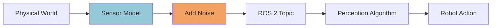
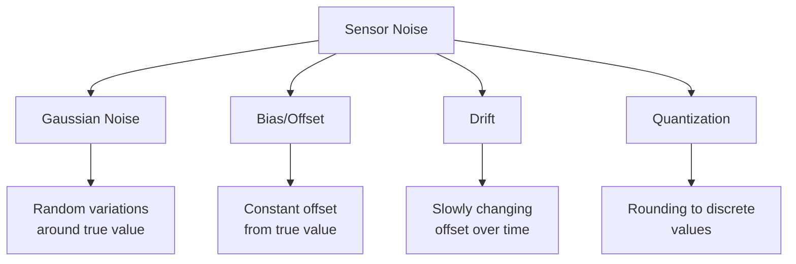
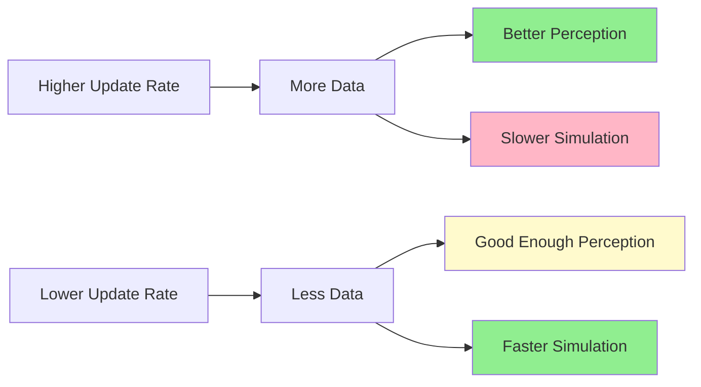
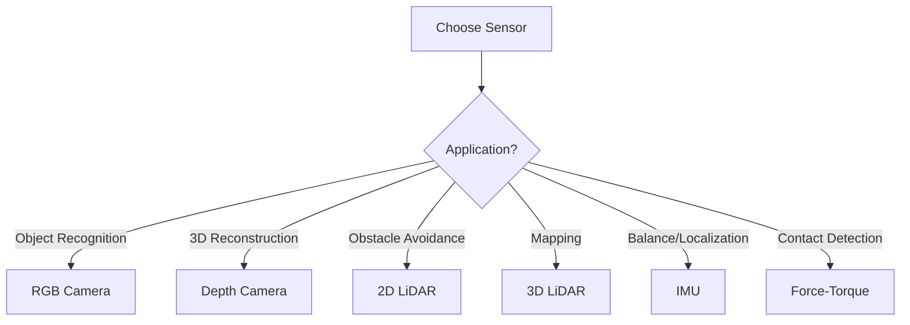

# Chapter 9: Sensor Simulation

## Learning Objectives

By the end of this chapter, you will be able to:

- **Configure** RGB and depth cameras in Gazebo and Unity
- **Simulate** 2D and 3D LiDAR sensors with point cloud output
- **Implement** IMU (Inertial Measurement Unit) sensors with realistic noise
- **Model** sensor noise (Gaussian, bias, drift) for sim-to-real transfer
- **Visualize** sensor data in RViz2 for debugging
- **Integrate** multiple sensors for perception pipelines
- **Optimize** sensor update rates for real-time performance

**Prerequisites**: Chapters 6-8 (Gazebo, Unity fundamentals)  
**Estimated Time**: 75 minutes

---

## Why Sensor Simulation Matters

Robots perceive the world through sensors. Before deploying on real hardware, you need to:

✅ **Test perception algorithms** without expensive sensors  
✅ **Generate training data** for machine learning models  
✅ **Validate sensor placement** (field of view, occlusions)  
✅ **Understand noise characteristics** for robust algorithm design  
✅ **Debug perception pipelines** in controlled environments

:::tip Industry Practice
Waymo generates **billions of synthetic sensor images** in simulation before testing on real cars. Simulation accelerates sensor testing by 1000x.
:::

---

## Overview of Robotic Sensors

### Common Sensor Types

| Sensor | Output | Use Case | Range | Cost (Real) |
|--------|--------|----------|-------|-------------|
| **RGB Camera** | Color images | Object detection, tracking | 1-50m | $50-500 |
| **Depth Camera** | RGB + Depth map | 3D reconstruction, SLAM | 0.5-10m | $200-400 |
| **2D LiDAR** | 2D point cloud | Navigation, mapping | 0.1-30m | $100-1000 |
| **3D LiDAR** | 3D point cloud | Autonomous driving, mapping | 0.1-100m | $1000-75000 |
| **IMU** | Acceleration, angular velocity | Localization, balance | N/A | $10-500 |
| **Force-Torque** | Forces, torques | Manipulation, contact detection | N/A | $1000-5000 |

### Sensor Data Flow



---

## RGB Camera Simulation

### Gazebo: RGB Camera Plugin

**Add to URDF:**

```xml
<!-- Camera link -->
<link name="camera_link">
  <visual>
    <geometry>
      <box size="0.05 0.05 0.05"/>
    </geometry>
    <material name="blue"/>
  </visual>
  <collision>
    <geometry>
      <box size="0.05 0.05 0.05"/>
    </geometry>
  </collision>
  <inertial>
    <mass value="0.1"/>
    <inertia ixx="0.0001" ixy="0" ixz="0" iyy="0.0001" iyz="0" izz="0.0001"/>
  </inertial>
</link>

<!-- Joint connecting camera to robot head -->
<joint name="camera_joint" type="fixed">
  <parent link="head_link"/>
  <child link="camera_link"/>
  <origin xyz="0.1 0 0.05" rpy="0 0 0"/>
</joint>

<!-- Gazebo camera plugin -->
<gazebo reference="camera_link">
  <sensor name="camera" type="camera">
    <update_rate>30.0</update_rate>
    <camera name="head_camera">
      <horizontal_fov>1.3962634</horizontal_fov>  <!-- 80 degrees -->
      <image>
        <width>640</width>
        <height>480</height>
        <format>R8G8B8</format>
      </image>
      <clip>
        <near>0.02</near>
        <far>300</far>
      </clip>
      <noise>
        <type>gaussian</type>
        <mean>0.0</mean>
        <stddev>0.007</stddev>  <!-- Realistic camera noise -->
      </noise>
    </camera>
    
    <!-- ROS 2 integration -->
    <plugin name="camera_controller" filename="libgazebo_ros_camera.so">
      <ros>
        <namespace>camera</namespace>
        <remapping>image_raw:=rgb/image_raw</remapping>
        <remapping>camera_info:=rgb/camera_info</remapping>
      </ros>
      <camera_name>head_camera</camera_name>
      <frame_name>camera_link</frame_name>
    </plugin>
  </sensor>
</gazebo>
```

**Test in Gazebo:**

```bash
# Launch Gazebo with robot
ros2 launch my_robot_description spawn_robot.launch.py

# View camera topics
ros2 topic list | grep camera
# Output: /camera/rgb/image_raw, /camera/rgb/camera_info

# Visualize camera feed
ros2 run rqt_image_view rqt_image_view /camera/rgb/image_raw
```

---

### Unity: RGB Camera Setup

**Add Camera Component:**

```csharp
using UnityEngine;
using Unity.Robotics.ROSTCPConnector;
using RosMessageTypes.Sensor;

public class RGBCameraPublisher : MonoBehaviour
{
    ROSConnection ros;
    public Camera rgbCamera;
    public string topicName = "camera/rgb/image_raw";
    public int publishRate = 30; // Hz
    
    private RenderTexture renderTexture;
    private Texture2D texture2D;
    
    void Start()
    {
        ros = ROSConnection.GetOrCreateInstance();
        ros.RegisterPublisher<ImageMsg>(topicName);
        
        // Setup render texture
        renderTexture = new RenderTexture(640, 480, 24);
        rgbCamera.targetTexture = renderTexture;
        texture2D = new Texture2D(640, 480, TextureFormat.RGB24, false);
        
        InvokeRepeating("PublishImage", 0f, 1f / publishRate);
    }
    
    void PublishImage()
    {
        // Read pixels from render texture
        RenderTexture.active = renderTexture;
        texture2D.ReadPixels(new Rect(0, 0, 640, 480), 0, 0);
        texture2D.Apply();
        
        // Convert to ROS message
        ImageMsg msg = new ImageMsg
        {
            header = new HeaderMsg 
            { 
                stamp = new TimeMsg(), 
                frame_id = "camera_link" 
            },
            height = 480,
            width = 640,
            encoding = "rgb8",
            is_bigendian = 0,
            step = 640 * 3,
            data = texture2D.GetRawTextureData()
        };
        
        ros.Publish(topicName, msg);
    }
}
```

**Add Realistic Camera Effects:**

```csharp
// Add to Camera component
using UnityEngine.Rendering.PostProcessing;

PostProcessVolume volume = gameObject.AddComponent<PostProcessVolume>();
volume.isGlobal = true;

var profile = ScriptableObject.CreateInstance<PostProcessProfile>();

// Add bloom (lens flare effect)
var bloom = profile.AddSettings<Bloom>();
bloom.intensity.value = 0.5f;

// Add grain (sensor noise)
var grain = profile.AddSettings<Grain>();
grain.intensity.value = 0.3f;
grain.size.value = 1.0f;

volume.profile = profile;
```

---

## Depth Camera Simulation

Depth cameras (like Intel RealSense D435i) output RGB + depth information.

### Gazebo: Depth Camera Plugin

```xml
<gazebo reference="depth_camera_link">
  <sensor name="depth_camera" type="depth">
    <update_rate>30.0</update_rate>
    <camera name="depth_camera">
      <horizontal_fov>1.5708</horizontal_fov>  <!-- 90 degrees -->
      <image>
        <width>640</width>
        <height>480</height>
        <format>R8G8B8</format>
      </image>
      <clip>
        <near>0.3</near>  <!-- Min depth: 30cm -->
        <far>10.0</far>   <!-- Max depth: 10m -->
      </clip>
    </camera>
    
    <plugin name="depth_controller" filename="libgazebo_ros_camera.so">
      <ros>
        <namespace>depth_camera</namespace>
        <remapping>image_raw:=rgb/image_raw</remapping>
        <remapping>depth/image_raw:=depth/image_raw</remapping>
        <remapping>points:=points</remapping>
      </ros>
      <camera_name>depth_camera</camera_name>
      <frame_name>depth_camera_link</frame_name>
      <hack_baseline>0.07</hack_baseline>  <!-- Stereo baseline -->
    </plugin>
  </sensor>
</gazebo>
```

**Accessing Depth Data:**

```python
import rclpy
from rclpy.node import Node
from sensor_msgs.msg import Image
from cv_bridge import CvBridge
import cv2
import numpy as np

class DepthProcessor(Node):
    def __init__(self):
        super().__init__('depth_processor')
        self.bridge = CvBridge()
        
        self.sub = self.create_subscription(
            Image,
            '/depth_camera/depth/image_raw',
            self.depth_callback,
            10
        )
    
    def depth_callback(self, msg):
        # Convert ROS Image to numpy array
        depth_image = self.bridge.imgmsg_to_cv2(msg, desired_encoding='passthrough')
        
        # Depth is in meters (float32)
        # Example: Get depth at center pixel
        center_x, center_y = depth_image.shape[1] // 2, depth_image.shape[0] // 2
        center_depth = depth_image[center_y, center_x]
        
        self.get_logger().info(f'Depth at center: {center_depth:.2f} meters')
        
        # Visualize depth (convert to 8-bit for display)
        depth_colormap = cv2.applyColorMap(
            cv2.convertScaleAbs(depth_image, alpha=25), 
            cv2.COLORMAP_JET
        )
        cv2.imshow('Depth Map', depth_colormap)
        cv2.waitKey(1)
```

---

### Unity: Depth Camera with Perception Package

```csharp
using UnityEngine.Perception.GroundTruth;

public class DepthCameraSetup : MonoBehaviour
{
    void Start()
    {
        Camera cam = GetComponent<Camera>();
        
        // Add Perception Camera
        PerceptionCamera perceptionCam = cam.gameObject.AddComponent<PerceptionCamera>();
        
        // Enable depth rendering
        cam.depthTextureMode = DepthTextureMode.Depth;
        
        // Add Instance Segmentation (outputs depth + object IDs)
        InstanceSegmentationLabeler segLabeler = new InstanceSegmentationLabeler();
        perceptionCam.AddLabeler(segLabeler);
        
        Debug.Log("Depth camera ready!");
    }
}
```

---

## LiDAR Simulation

LiDAR (Light Detection and Ranging) emits laser beams and measures distances.

### 2D LiDAR (Single Plane Scan)

**Gazebo Configuration:**

```xml
<gazebo reference="lidar_link">
  <sensor name="lidar_2d" type="ray">
    <update_rate>10.0</update_rate>
    <ray>
      <scan>
        <horizontal>
          <samples>360</samples>  <!-- 360 samples = 1° resolution -->
          <resolution>1</resolution>
          <min_angle>-3.14159</min_angle>  <!-- -180° -->
          <max_angle>3.14159</max_angle>   <!-- +180° -->
        </horizontal>
      </scan>
      <range>
        <min>0.1</min>  <!-- 10cm min range -->
        <max>30.0</max> <!-- 30m max range -->
        <resolution>0.01</resolution>
      </range>
      <noise>
        <type>gaussian</type>
        <mean>0.0</mean>
        <stddev>0.01</stddev>  <!-- 1cm standard deviation -->
      </noise>
    </ray>
    
    <plugin name="lidar_controller" filename="libgazebo_ros_ray_sensor.so">
      <ros>
        <namespace>lidar</namespace>
        <remapping>~/out:=scan</remapping>
      </ros>
      <output_type>sensor_msgs/LaserScan</output_type>
      <frame_name>lidar_link</frame_name>
    </plugin>
  </sensor>
</gazebo>
```

**Visualize in RViz2:**

```bash
# Launch RViz2
rviz2

# Add LaserScan display
# Fixed Frame: base_link
# Topic: /lidar/scan
# Size: 0.05
# Color: Red
```

---

### 3D LiDAR (Multi-Layer Scan)

**Gazebo 3D LiDAR:**

```xml
<gazebo reference="lidar_3d_link">
  <sensor name="lidar_3d" type="gpu_ray">  <!-- GPU-accelerated -->
    <update_rate>10.0</update_rate>
    <ray>
      <scan>
        <horizontal>
          <samples>1024</samples>  <!-- Horizontal resolution -->
          <min_angle>-3.14159</min_angle>
          <max_angle>3.14159</max_angle>
        </horizontal>
        <vertical>
          <samples>64</samples>  <!-- 64 vertical layers -->
          <min_angle>-0.5236</min_angle>  <!-- -30° -->
          <max_angle>0.1745</max_angle>   <!-- +10° -->
        </vertical>
      </scan>
      <range>
        <min>0.5</min>
        <max>100.0</max>
      </range>
    </ray>
    
    <plugin name="lidar_3d_controller" filename="libgazebo_ros_ray_sensor.so">
      <ros>
        <namespace>lidar_3d</namespace>
        <remapping>~/out:=points</remapping>
      </ros>
      <output_type>sensor_msgs/PointCloud2</output_type>
      <frame_name>lidar_3d_link</frame_name>
    </plugin>
  </sensor>
</gazebo>
```

**Processing Point Cloud:**

```python
from sensor_msgs.msg import PointCloud2
import sensor_msgs_py.point_cloud2 as pc2
import numpy as np

class PointCloudProcessor(Node):
    def __init__(self):
        super().__init__('pointcloud_processor')
        self.sub = self.create_subscription(
            PointCloud2,
            '/lidar_3d/points',
            self.pointcloud_callback,
            10
        )
    
    def pointcloud_callback(self, msg):
        # Convert to numpy array
        points = pc2.read_points(msg, field_names=("x", "y", "z"), skip_nans=True)
        points_array = np.array(list(points))
        
        # Example: Filter points within 5m
        distances = np.linalg.norm(points_array, axis=1)
        close_points = points_array[distances < 5.0]
        
        self.get_logger().info(f'Points within 5m: {len(close_points)}')
```

**RViz2 PointCloud2 Visualization:**

```bash
# In RViz2
Add → PointCloud2
Topic: /lidar_3d/points
Style: Points
Size: 0.02
Color Transformer: AxisColor (Z-axis)
```

---

## IMU (Inertial Measurement Unit) Simulation

IMU provides acceleration and angular velocity data for localization.

### Gazebo IMU Plugin

```xml
<gazebo reference="imu_link">
  <sensor name="imu_sensor" type="imu">
    <update_rate>100.0</update_rate>  <!-- High rate for control -->
    <imu>
      <angular_velocity>
        <x>
          <noise type="gaussian">
            <mean>0.0</mean>
            <stddev>0.0002</stddev>  <!-- Gyroscope noise -->
            <bias_mean>0.0001</bias_mean>
            <bias_stddev>0.00001</bias_stddev>
          </noise>
        </x>
        <y>
          <noise type="gaussian">
            <mean>0.0</mean>
            <stddev>0.0002</stddev>
          </noise>
        </y>
        <z>
          <noise type="gaussian">
            <mean>0.0</mean>
            <stddev>0.0002</stddev>
          </noise>
        </z>
      </angular_velocity>
      
      <linear_acceleration>
        <x>
          <noise type="gaussian">
            <mean>0.0</mean>
            <stddev>0.017</stddev>  <!-- Accelerometer noise -->
            <bias_mean>0.1</bias_mean>
            <bias_stddev>0.001</bias_stddev>
          </noise>
        </x>
        <y>
          <noise type="gaussian">
            <mean>0.0</mean>
            <stddev>0.017</stddev>
          </noise>
        </y>
        <z>
          <noise type="gaussian">
            <mean>0.0</mean>
            <stddev>0.017</stddev>
          </noise>
        </z>
      </linear_acceleration>
    </imu>
    
    <plugin name="imu_controller" filename="libgazebo_ros_imu_sensor.so">
      <ros>
        <namespace>imu</namespace>
        <remapping>~/out:=data</remapping>
      </ros>
      <frame_name>imu_link</frame_name>
    </plugin>
  </sensor>
</gazebo>
```

**Reading IMU Data:**

```python
from sensor_msgs.msg import Imu

class IMUReader(Node):
    def __init__(self):
        super().__init__('imu_reader')
        self.sub = self.create_subscription(Imu, '/imu/data', self.imu_callback, 10)
    
    def imu_callback(self, msg):
        # Orientation (quaternion)
        quat = msg.orientation
        
        # Angular velocity (rad/s)
        angular_vel = msg.angular_velocity
        
        # Linear acceleration (m/s²)
        linear_acc = msg.linear_acceleration
        
        self.get_logger().info(
            f'IMU - Accel: ({linear_acc.x:.2f}, {linear_acc.y:.2f}, {linear_acc.z:.2f})'
        )
```

---

## Sensor Noise Modeling

Realistic noise is crucial for sim-to-real transfer.

### Types of Noise



---

### Gaussian Noise Example

```xml
<!-- In Gazebo sensor definition -->
<noise>
  <type>gaussian</type>
  <mean>0.0</mean>  <!-- No systematic error -->
  <stddev>0.01</stddev>  <!-- 1cm standard deviation -->
</noise>
```

**Effect**: Measurements vary randomly around true value.

---

### Bias and Drift

```xml
<!-- IMU accelerometer with bias -->
<linear_acceleration>
  <x>
    <noise type="gaussian">
      <mean>0.0</mean>
      <stddev>0.017</stddev>
      <bias_mean>0.1</bias_mean>  <!-- 0.1 m/s² constant bias -->
      <bias_stddev>0.001</bias_stddev>
    </noise>
  </x>
</linear_acceleration>
```

**Effect**: Sensor consistently over/under-estimates by a fixed amount.

---

### Custom Noise in Unity

```csharp
public class NoisyDepthCamera : MonoBehaviour
{
    public float gaussianStdDev = 0.01f;  // 1cm
    public float bias = 0.05f;  // 5cm constant offset
    
    float AddNoise(float trueDepth)
    {
        // Gaussian noise
        float gaussian = GaussianRandom(0f, gaussianStdDev);
        
        // Add bias
        float noisyDepth = trueDepth + gaussian + bias;
        
        // Clamp to valid range
        return Mathf.Clamp(noisyDepth, 0.3f, 10f);
    }
    
    float GaussianRandom(float mean, float stdDev)
    {
        // Box-Muller transform
        float u1 = 1.0f - Random.value;
        float u2 = 1.0f - Random.value;
        float randStdNormal = Mathf.Sqrt(-2.0f * Mathf.Log(u1)) * Mathf.Sin(2.0f * Mathf.PI * u2);
        return mean + stdDev * randStdNormal;
    }
}
```

---

## Multi-Sensor Integration

Real robots use **sensor fusion** to combine data from multiple sensors.

### Example: Camera + LiDAR + IMU

```python
class SensorFusion(Node):
    def __init__(self):
        super().__init__('sensor_fusion')
        
        # Subscribers
        self.camera_sub = self.create_subscription(Image, '/camera/rgb/image_raw', self.camera_cb, 10)
        self.lidar_sub = self.create_subscription(LaserScan, '/lidar/scan', self.lidar_cb, 10)
        self.imu_sub = self.create_subscription(Imu, '/imu/data', self.imu_cb, 10)
        
        self.latest_image = None
        self.latest_scan = None
        self.latest_imu = None
        
        # Fused perception timer
        self.timer = self.create_timer(0.1, self.fuse_sensors)  # 10 Hz
    
    def camera_cb(self, msg):
        self.latest_image = msg
    
    def lidar_cb(self, msg):
        self.latest_scan = msg
    
    def imu_cb(self, msg):
        self.latest_imu = msg
    
    def fuse_sensors(self):
        if all([self.latest_image, self.latest_scan, self.latest_imu]):
            # Example fusion logic
            # 1. Use IMU for orientation
            # 2. Use LiDAR for obstacle detection
            # 3. Use camera for object recognition
            
            self.get_logger().info('All sensors available - running fusion')
            
            # Your fusion algorithm here
            pass
```

---

## RViz2 Visualization Configuration

### Complete RViz2 Setup for Sensor Debugging

**Save this as `sensors.rviz`:**

```yaml
Panels:
  - Class: rviz_common/Displays
    Name: Displays
    
Visualization Manager:
  Global Options:
    Fixed Frame: base_link
    
  Displays:
    - Class: rviz_default_plugins/Image
      Name: RGB Camera
      Topic: /camera/rgb/image_raw
      
    - Class: rviz_default_plugins/Image
      Name: Depth Camera
      Topic: /depth_camera/depth/image_raw
      
    - Class: rviz_default_plugins/LaserScan
      Name: 2D LiDAR
      Topic: /lidar/scan
      Size: 0.05
      Color: 255; 0; 0
      
    - Class: rviz_default_plugins/PointCloud2
      Name: 3D LiDAR
      Topic: /lidar_3d/points
      Size: 0.02
      Color Transformer: AxisColor
      Axis: Z
      
    - Class: rviz_default_plugins/Axes
      Name: IMU Frame
      Reference Frame: imu_link
      Length: 0.3
      Radius: 0.02
```

**Launch RViz with config:**

```bash
rviz2 -d sensors.rviz
```

---

## Performance Optimization

### Sensor Update Rate vs. Real-Time Factor



### Recommended Update Rates

| Sensor | Update Rate | Rationale |
|--------|------------|-----------|
| **RGB Camera** | 30 Hz | Standard video frame rate |
| **Depth Camera** | 15-30 Hz | Balance between data and computation |
| **2D LiDAR** | 10-40 Hz | Depends on robot speed |
| **3D LiDAR** | 10 Hz | Very compute-intensive |
| **IMU** | 100-200 Hz | High rate needed for accurate integration |

---

### Gazebo Performance Tips

```xml
<!-- Use GPU-accelerated sensors when possible -->
<sensor name="lidar" type="gpu_ray">  <!-- NOT "ray" -->
  ...
</sensor>

<!-- Reduce resolution for faster simulation -->
<horizontal>
  <samples>180</samples>  <!-- Instead of 360 -->
</horizontal>

<!-- Lower update rate during development -->
<update_rate>5.0</update_rate>  <!-- Instead of 30 -->
```

---

## Complete Sensor Suite Example

### Humanoid with Full Sensor Array

```xml
<!-- Head camera (RGB + Depth) -->
<gazebo reference="head_camera_link">
  <sensor name="rgbd_camera" type="depth">
    <update_rate>30.0</update_rate>
    <!-- Configuration as shown earlier -->
  </sensor>
</gazebo>

<!-- Chest LiDAR (for navigation) -->
<gazebo reference="chest_lidar_link">
  <sensor name="chest_lidar" type="ray">
    <update_rate>10.0</update_rate>
    <!-- 2D LiDAR config -->
  </sensor>
</gazebo>

<!-- Torso IMU (for balance) -->
<gazebo reference="torso_imu_link">
  <sensor name="torso_imu" type="imu">
    <update_rate>100.0</update_rate>
    <!-- IMU config -->
  </sensor>
</gazebo>

<!-- Foot force-torque sensors -->
<gazebo reference="left_foot_link">
  <sensor name="left_foot_ft" type="force_torque">
    <update_rate>100.0</update_rate>
    <plugin name="ft_controller" filename="libgazebo_ros_ft_sensor.so">
      <ros>
        <namespace>left_foot</namespace>
        <remapping>~/out:=wrench</remapping>
      </ros>
    </plugin>
  </sensor>
</gazebo>
```

---

## Summary

### 🎯 Key Takeaways

- **Cameras** provide rich visual data for object detection and tracking
- **LiDAR** excels at distance measurement and mapping (2D/3D)
- **IMU** is essential for orientation and acceleration estimation
- **Sensor noise** modeling is critical for realistic sim-to-real transfer
- **RViz2** is the go-to tool for visualizing sensor data in ROS 2
- **Update rates** must balance perception quality with simulation speed
- **Multi-sensor fusion** combines complementary sensor strengths

### 📊 Sensor Comparison



---

## Hands-On Exercise

### Task: Create Multi-Sensor Humanoid

**Requirements**:
1. Add RGB camera to robot head (640x480, 30Hz)
2. Add 2D LiDAR to chest (360 samples, 10Hz)
3. Add IMU to torso (100Hz with realistic noise)
4. Launch in Gazebo and verify all topics publish
5. Visualize all sensors in RViz2 simultaneously
6. Record 30 seconds of sensor data using `ros2 bag`

**Success Criteria**:
- All sensor topics appear in `ros2 topic list`
- Camera shows valid RGB image in rqt_image_view
- LiDAR shows obstacles in RViz2
- IMU publishes orientation quaternion
- Simulation maintains RTF > 0.8

**Estimated Time**: 40 minutes

---

## Further Resources

### Official Documentation
- 📘 [Gazebo Sensors](https://gazebosim.org/api/sensors/6/tutorials.html) - All sensor types
- 📷 [ROS 2 Image Pipeline](https://github.com/ros-perception/image_pipeline) - Camera processing
- 📡 [sensor_msgs](https://github.com/ros2/common_interfaces/tree/rolling/sensor_msgs) - ROS 2 message formats

### Tutorials
- 🎥 [RViz2 Sensor Visualization](https://www.youtube.com/watch?v=<example>) - Complete guide
- 📝 [Unity Perception Tutorial](https://github.com/Unity-Technologies/com.unity.perception) - Synthetic data generation

### Tools
- 🛠️ [PlotJuggler](https://github.com/facontidavide/PlotJuggler) - Visualize sensor data over time
- 🛠️ [Foxglove Studio](https://foxglove.dev/) - Modern ROS 2 visualization

---

## What's Next?

In **Chapter 10**, you'll learn **Sim-to-Real Transfer Techniques**:
- Understanding reality gap sources in depth
- Implementing domain randomization for robust policies
- System identification for accurate parameter estimation
- Progressive transfer learning strategies
- Validating simulation results on real hardware

Complete the simulation loop and prepare for real-world deployment! 🚀🤖

---

:::note Chapter Completion
✅ You've completed Chapter 9: Sensor Simulation  
⏱️ Estimated time to complete: 75 minutes  
📊 Progress: Module 2 - Chapter 4 of 5
:::
