# Chapter 11: NVIDIA Isaac Ecosystem Overview

## Learning Objectives

By the end of this chapter, you will be able to:

- **Explain** the NVIDIA Isaac platform components and their roles
- **Understand** Omniverse architecture and USD (Universal Scene Description) format
- **Compare** Isaac Sim with Gazebo and Unity for robotics simulation
- **Describe** GPU-accelerated physics with PhysX engine
- **Recognize** RTX ray tracing benefits for photorealistic rendering
- **Identify** Isaac's position in the sim-to-real AI workflow
- **Assess** hardware requirements for Isaac development

**Prerequisites**: Modules 1-2 (ROS 2, Simulation fundamentals)  
**Estimated Time**: 45 minutes

---

## What is NVIDIA Isaac?

**NVIDIA Isaac** is a comprehensive platform for developing, testing, and deploying AI-powered robots. It combines simulation, perception, and deployment tools into a unified ecosystem.

### The Isaac Platform Components

---

### Isaac Sim: The Simulation Engine

**Isaac Sim** is a robotics simulator built on NVIDIA Omniverse, designed for physically accurate and photorealistic robot simulation.

**Key Features:**
- **PhysX 5**: GPU-accelerated physics engine
- **RTX Ray Tracing**: Photorealistic lighting and materials
- **USD Support**: Industry-standard 3D scene format
- **Python API**: Scriptable automation for large-scale testing
- **ROS 2 Integration**: Native bridges to ROS ecosystem

**Use Cases:**
- Training reinforcement learning policies
- Generating synthetic training data
- Testing perception algorithms
- Validating robot behaviors before deployment

---

### Isaac ROS: Production-Ready Perception

**Isaac ROS** provides GPU-accelerated ROS 2 packages for perception tasks.

**Packages Include:**
- **Visual SLAM**: Stereo camera-based localization
- **Depth Processing**: GPU-accelerated stereo depth
- **Object Detection**: DNN inference with TensorRT
- **Image Processing**: GPU-accelerated filters and transformations

**Why GPU Acceleration?**

| Task | CPU (i7) | GPU (RTX 4070) | Speedup |
|------|----------|----------------|---------|
| Stereo Depth | 5 FPS | 60 FPS | **12x** |
| Object Detection | 10 FPS | 90 FPS | **9x** |
| Visual SLAM | 15 FPS | 120 FPS | **8x** |

:::tip Performance Benefit
GPU acceleration enables **real-time** perception on computationally intensive tasks, critical for autonomous robots.
:::

---

### Isaac SDK: Navigation & Manipulation

**Isaac SDK** (now mostly integrated into Isaac ROS) provides:
- **Navigation Stack**: Path planning, obstacle avoidance
- **Manipulation**: Grasp planning, motion planning
- **Behavior Trees**: High-level decision-making

**Note**: In this course, we focus on **Isaac Sim** and **Isaac ROS** as they're the most relevant for Physical AI development.

---

## Omniverse: The Foundation

**NVIDIA Omniverse** is a platform for 3D design collaboration and simulation, built on USD (Universal Scene Description).

### What is USD?

**USD (Universal Scene Description)** is Pixar's open-source format for 3D scenes, adopted as the standard for Omniverse.

**Advantages over URDF/SDF:**

| Feature | **URDF** | **SDF** | **USD** |
|---------|---------|---------|---------|
| **Scene Complexity** | Single robot | Multi-robot world | Entire production pipeline |
| **Collaboration** | Limited | Limited | Real-time multi-user |
| **Rendering** | Basic | Basic | Photorealistic (RTX) |
| **Animation** | No | Limited | Full skeletal animation |
| **Industry Adoption** | ROS community | Gazebo community | Film, gaming, simulation |

:::note URDF to USD Conversion
Isaac Sim can **import URDF** files and convert them to USD automatically, so your Module 1 humanoid URDF works directly!
:::

---

### Omniverse Nucleus: Collaboration Server

**Nucleus** is Omniverse's collaboration platform that allows multiple users to work on the same scene simultaneously.

**Features:**
- Real-time scene synchronization
- Version control for 3D assets
- Asset sharing across teams
- Cloud or local deployment

**Example Workflow:**
1. **Roboticist** creates robot model (USD)
2. **3D Artist** adds realistic materials and lighting
3. **AI Engineer** runs simulations and generates data
4. All work happens **simultaneously** on the same scene!

---

## Isaac Sim vs. Gazebo vs. Unity

Let's compare the three major simulation platforms:

### Detailed Comparison

| Aspect | **Gazebo** | **Unity** | **Isaac Sim** |
|--------|-----------|----------|---------------|
| **Physics Engine** | ODE/Bullet/DART | PhysX (CPU) | PhysX 5 (GPU) |
| **Rendering** | Basic OpenGL | URP/HDRP (Good) | RTX (Photorealistic) |
| **ROS Integration** | Native (ros_gz) | TCP Bridge | Native (ROS 2) |
| **GPU Acceleration** | Limited (gpu_ray) | Partial | Full (physics + rendering) |
| **Synthetic Data** | Limited | Perception Package | Replicator (Advanced) |
| **Learning Curve** | Medium | Medium-High | High |
| **Cost** | Free | Free (Personal) | Free (Individual) |
| **Best For** | Physics testing | Game-quality visuals | AI training at scale |

---

### When to Use Each

**Our Recommendation**: 
- **Gazebo**: Control algorithm development
- **Unity**: Computer vision prototyping
- **Isaac Sim**: Production AI training and deployment

---

## GPU-Accelerated Physics with PhysX

**PhysX 5** is NVIDIA's physics engine, specifically designed for GPU computation.

### Key Innovations

1. **GPU Rigid Body Dynamics**
   - Simulate 10,000+ rigid bodies in real-time
   - Parallel collision detection on GPU

2. **Articulation System**
   - Optimized for robots (many joints)
   - Reduced coordinate formulation (faster than maximal)

3. **Soft Body Simulation**
   - Deformable objects (cloth, rubber)
   - Useful for grasping and manipulation

### Performance Example

**Scenario**: Simulating 100 humanoid robots simultaneously

| Engine | Device | Real-Time Factor |
|--------|--------|------------------|
| ODE | CPU (i7) | 0.1x (10x slower) |
| Bullet | CPU (i7) | 0.15x (6x slower) |
| PhysX | CPU (i7) | 0.3x (3x slower) |
| PhysX 5 | GPU (RTX 4070) | **5.0x** (5x faster!) |

:::tip Parallel Training
GPU physics enables training 100+ policies **in parallel** on a single machine, replacing entire GPU clusters.
:::

---

## RTX Ray Tracing for Photorealism

**RTX** (Ray Tracing eXtensions) uses dedicated hardware (RT cores) for realistic lighting.

### Ray Tracing vs. Rasterization

**Rasterization** (traditional):
- Projects triangles onto screen
- Approximates lighting with shaders
- Fast but limited realism

**Ray Tracing** (RTX):
- Simulates actual light paths
- Accurate shadows, reflections, refractions
- Computationally expensive (but fast with RT cores)

---

### Visual Comparison

**Rasterization** (Gazebo, Unity without RTX):
- Hard shadows
- No true reflections
- Screen-space effects

**Ray Tracing** (Isaac Sim with RTX):
- Soft shadows with penumbra
- Perfect mirror reflections
- Realistic global illumination

:::note For Computer Vision
Photorealistic rendering trains better vision models because synthetic images closely match real camera data.
:::

---

## Isaac in the Sim-to-Real Pipeline

Here's how Isaac fits into the complete Physical AI development workflow:

```mermaid
graph LR
    A[Design Robot<br/>CAD/URDF] --> B[Isaac Sim:<br/>Test & Validate]
    B --> C[Isaac Sim:<br/>Generate Syn Data]
    C --> D[Train AI Model<br/>PyTorch/TF]
    D --> E[Isaac Sim:<br/>Test Policy]
    E --> F{Pass?}
    F -->|No| B
    F -->|Yes| G[Isaac ROS:<br/>Deploy to Jetson]
    G --> H[Real Robot<br/>Testing]
    H --> I{Success?}
    I -->|No| J[System ID]
    J --> B
    I -->|Yes| K[Production ✅]
    
    style B fill:#76B900
    style C fill:#76B900
    style E fill:#76B900
    style G fill:#76B900
    style K fill:#FFD700
```

**Isaac's Role**:
1. **Simulation**: Test behaviors safely
2. **Data Generation**: Create millions of training examples
3. **Policy Training**: RL with GPU physics
4. **Deployment**: Isaac ROS on Jetson edge devices

---

## Hardware Requirements

### Development Workstation

**Minimum Requirements** (Isaac Sim):
- **GPU**: NVIDIA RTX 2070 or better (8GB VRAM)
- **CPU**: Intel i7 / AMD Ryzen 7
- **RAM**: 32 GB
- **OS**: Ubuntu 20.04 or 22.04 LTS
- **Storage**: 50 GB SSD

**Recommended** (for production work):
- **GPU**: NVIDIA RTX 4080 / A6000 (16+ GB VRAM)
- **CPU**: Intel i9 / AMD Ryzen 9
- **RAM**: 64 GB DDR5
- **OS**: Ubuntu 22.04 LTS
- **Storage**: 500 GB NVMe SSD

:::warning GPU is Critical
Isaac Sim **requires RTX GPU**. Older GTX series (no RT cores) will run very slowly.
:::

---

### Edge Deployment Device

**For Robot Deployment** (Isaac ROS):

**NVIDIA Jetson Orin Nano** (Recommended for this course):
- **GPU**: 1024-core NVIDIA Ampere
- **CPU**: 6-core ARM Cortex-A78AE
- **RAM**: 8 GB
- **AI Performance**: 40 TOPS
- **Power**: 7-15W
- **Cost**: ~$250

**NVIDIA Jetson Orin NX** (Advanced):
- **AI Performance**: 100 TOPS
- **RAM**: 16 GB
- **Cost**: ~$600

**Deployment Pattern**:
- **Train on Workstation** (RTX 4080): GPU physics, RL training
- **Deploy to Jetson** (Orin Nano): Run inference on robot

---

## Isaac Platform Ecosystem

### Related NVIDIA Tools

**Isaac Gym**: 
- GPU-accelerated RL training (thousands of parallel envs)
- Focused on reinforcement learning research
- Not covered in this course (advanced topic)

**Isaac Cortex**:
- AI-powered behavior orchestration
- Uses LLMs for high-level planning
- Connects to Module 4 (VLA)

---

## Cost Considerations

### Licensing

| Product | License | Cost |
|---------|---------|------|
| **Isaac Sim** | Free (Individual) | $0 |
| **Isaac Sim** | Enterprise | Contact Sales |
| **Isaac ROS** | Open Source (Apache 2.0) | $0 |
| **Omniverse Nucleus** | Free (Local) | $0 |
| **Omniverse Nucleus** | Cloud (Enterprise) | Subscription |

**For Students/Hackers**: Completely free! 🎉

---

### Compute Costs

**Cloud Option** (if no RTX GPU):

**AWS g5.xlarge** (NVIDIA A10G):
- Cost: ~$1.00/hour
- 10 hours/week training: ~$40/month
- Good alternative to buying GPU

**However**: For serious development, **buying RTX 4070 Ti** (~$800) pays for itself in 20 weeks of AWS usage.

---

## Getting Started Roadmap

### Learning Path for Isaac

**Timeline**:
- **Chapter 11** (This chapter): 45 min - Understand ecosystem
- **Chapter 12**: 90 min - Hands-on Isaac Sim
- **Chapter 13**: 90 min - Deploy Isaac ROS SLAM
- **Chapter 14**: 75 min - Configure Nav2 for humanoid
- **Chapter 15**: 75 min - Generate synthetic datasets

**Total Module 3**: ~6 hours

---

## Real-World Success Stories

### Case Study 1: Warehouse Robotics

**Company**: Amazon Robotics  
**Challenge**: Navigate crowded warehouses, avoid humans  
**Isaac Usage**:
- Trained navigation policies in Isaac Sim
- Generated 10M synthetic warehouse scenarios
- Deployed with Isaac ROS on custom robots

**Results**:
- 95% navigation success rate
- 50% reduction in training time vs. real-world testing

---

### Case Study 2: Autonomous Manipulation

**Company**: NVIDIA Research  
**Challenge**: Grasp and manipulate unknown objects  
**Isaac Usage**:
- Isaac Sim with PhysX for contact-rich simulation
- Domain randomization (100,000 object variations)
- Isaac ROS for real-time object detection

**Results**:
- 80% grasp success on novel objects
- Zero real-world training data needed

---

## Advantages of Isaac for Physical AI

### Why Choose Isaac?

1. **GPU Acceleration**
   - Train 100x faster than CPU-based simulators
   - Real-time physics for complex scenes

2. **Photorealism**
   - RTX rendering matches real camera images
   - Better sim-to-real transfer for vision

3. **Scalability**
   - Simulate thousands of robots in parallel
   - Generate massive datasets automatically

4. **Production-Ready**
   - Isaac ROS optimized for Jetson deployment
   - TensorRT integration for fast inference

5. **Ecosystem Integration**
   - Works with PyTorch, TensorFlow
   - ROS 2 native support
   - Kubernetes for cloud deployment

---

## Challenges and Limitations

### What to Watch Out For

**High Learning Curve**:
- Omniverse UI is complex
- USD format has steep learning curve
- Debugging can be challenging

**Hardware Requirements**:
- RTX GPU mandatory (expensive)
- High RAM usage (32GB minimum)
- Large disk space for assets

**Maturity**:
- Newer than Gazebo (fewer tutorials)
- Some features still in beta
- Community smaller (but growing rapidly)

**Solution**: This course provides structured learning path to overcome these challenges!

---

## Summary

### 🎯 Key Takeaways

- **NVIDIA Isaac** is a complete platform for Physical AI development
- **Isaac Sim** provides GPU-accelerated, photorealistic simulation
- **Isaac ROS** offers production-ready perception for Jetson deployment
- **Omniverse & USD** enable industry-standard 3D collaboration
- **PhysX 5** delivers 10x faster physics than CPU simulators
- **RTX ray tracing** creates photorealistic synthetic data
- **Hardware requirements** are significant but necessary for cutting-edge AI

### 📊 Platform Positioning

---

## Self-Assessment

Test your understanding:

1. **What are the three main components of the Isaac platform?**
   

   
Answer

   Isaac Sim (simulation), Isaac ROS (perception), and Isaac SDK (navigation/manipulation).
   

2. **How does PhysX 5 differ from traditional physics engines?**
   

   
Answer

   PhysX 5 runs physics computations on the GPU, enabling 10x+ faster simulation and parallel training of thousands of robots.
   

3. **Why is RTX ray tracing important for robotics?**
   

   
Answer

   Photorealistic rendering creates synthetic training data that closely matches real camera images, improving sim-to-real transfer for vision models.
   

4. **What is USD and why does Isaac use it?**
   

   
Answer

   USD (Universal Scene Description) is an industry-standard 3D format that enables collaboration, animation, and photorealistic rendering beyond what URDF/SDF offer.
   

5. **What GPU is minimum for Isaac Sim?**
   

   
Answer

   NVIDIA RTX 2070 or better with 8GB+ VRAM. RT cores are required for ray tracing.
   

---

## Further Resources

### Official Documentation
- 📘 [Isaac Sim Documentation](https://docs.omniverse.nvidia.com/isaacsim/latest/) - Complete reference
- 🔧 [Isaac ROS Documentation](https://nvidia-isaac-ros.github.io/) - ROS 2 packages
- 🎨 [Omniverse Documentation](https://docs.omniverse.nvidia.com/) - Platform overview

### Video Tutorials
- 🎥 [Isaac Sim Quick Start](https://www.youtube.com/watch?v=<example>) - NVIDIA official
- 🎥 [Isaac ROS Tutorial Series](https://www.youtube.com/playlist?list=<example>) - Perception examples

### Community
- 💬 [NVIDIA Developer Forums - Robotics](https://forums.developer.nvidia.com/c/robotics/) - Official support
- 💬 [Isaac Sim Discord](https://discord.gg/<example>) - Community discussions

### Papers
- 📄 [PhysX 5 White Paper](https://developer.nvidia.com/physx) - Technical details
- 📄 [Isaac Gym Paper](https://arxiv.org/abs/2108.10470) - GPU RL training

---

## What's Next?

In **Chapter 12**, you'll get hands-on with **Isaac Sim**:
- Installing Isaac Sim via Omniverse Launcher
- Navigating the Isaac Sim UI
- Importing your URDF humanoid as USD
- Creating photorealistic warehouse scene
- Writing Python scripts for automation
- Running physics simulations

**Prepare to enter the world of GPU-accelerated robotics!** 🚀🤖

---

:::note Chapter Completion
✅ You've completed Chapter 11: NVIDIA Isaac Ecosystem Overview  
⏱️ Estimated time to complete: 45 minutes  
📊 Progress: Module 3 - Chapter 1 of 5
:::
