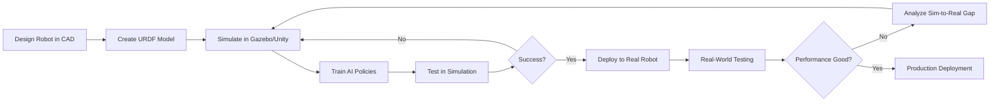
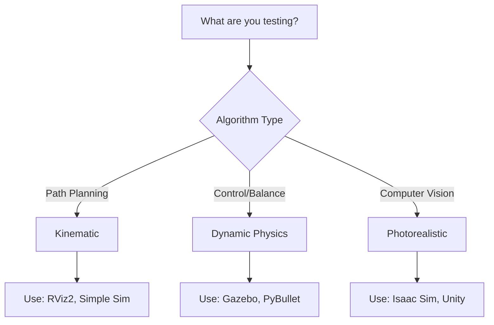
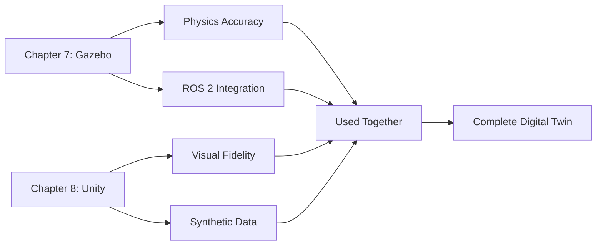
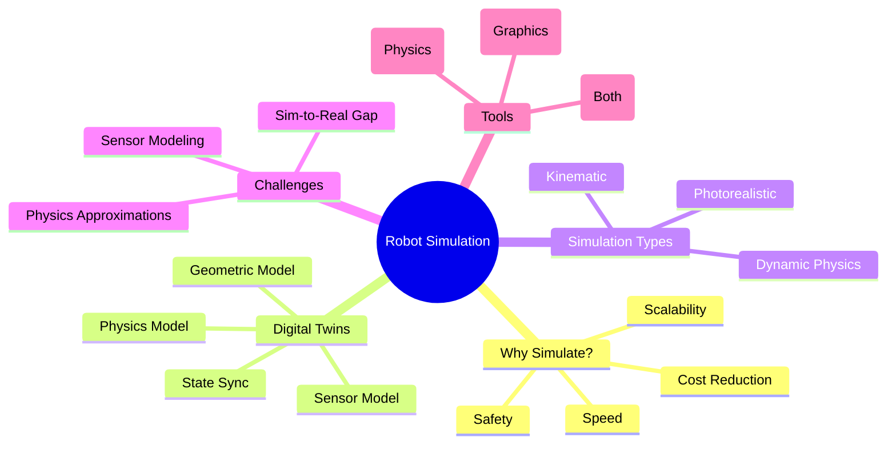

# Chapter 6: Introduction to Robot Simulation

## Learning Objectives

By the end of this chapter, you will be able to:

- **Explain** why simulation is critical in modern robotics development
- **Define** the concept of digital twins and their applications in robotics
- **Compare** simulation-based development versus physical robot testing
- **Identify** different types of simulation fidelity and their trade-offs
- **Understand** the sim-to-real gap and strategies to bridge it
- **Distinguish** between physics-first (Gazebo) and graphics-first (Unity) simulators

**Prerequisites**: Module 1 (ROS 2 fundamentals, URDF modeling)  
**Estimated Time**: 45 minutes

---

## Why Simulation Matters in Robotics

Imagine you're developing a humanoid robot that needs to navigate a crowded office, avoid obstacles, and deliver packages. Testing this behavior on a real robot would be:

- **Expensive**: Physical robots cost thousands to millions of dollars. Crashes mean repairs.
- **Dangerous**: A 50kg humanoid falling could injure people or damage property.
- **Slow**: Real-world testing is bound by physics—you can't fast-forward time.
- **Limited**: You can only test one scenario at a time with one robot.

**Simulation changes everything.**

### The Power of Virtual Testing

In simulation, you can:

✅ **Test safely**: Robots can fall, crash, and fail without consequences  
✅ **Iterate quickly**: Run thousands of tests in parallel, faster than real-time  
✅ **Scale infinitely**: Simulate 100 robots simultaneously  
✅ **Explore edge cases**: Test rare scenarios (e.g., earthquake during navigation)  
✅ **Reduce costs**: A simulated robot costs $0 after software setup  

:::tip Real-World Example
Waymo (self-driving cars) runs **20 million miles of simulation per day**. This would take a physical fleet 300+ years to accumulate. Simulation accelerates development by ~100,000x.
:::

---

## The Development Lifecycle with Simulation

Modern robotics follows a **simulation-first** approach:



### Typical Workflow

1. **Design Phase**: Create robot geometry in CAD (SolidWorks, Fusion 360)
2. **Modeling Phase**: Convert to URDF (you learned this in Module 1!)
3. **Simulation Phase**: 
   - Test physics behavior (Gazebo)
   - Visualize interactions (Unity)
   - Generate synthetic training data
4. **Training Phase**: Use simulated data to train AI models
5. **Deployment Phase**: Transfer learned policies to real robot
6. **Iteration Phase**: Refine simulation based on real-world performance

:::note Development Time Comparison
- **Without Simulation**: 6-12 months from design to working prototype
- **With Simulation**: 2-4 months from design to working prototype

Simulation reduces iteration cycles from **weeks to hours**.
:::

---

## Digital Twins: Your Robot's Virtual Doppelgänger

A **digital twin** is a virtual replica of a physical system that mirrors its behavior, state, and environment in real-time.

### Components of a Robotic Digital Twin

1. **Geometric Model**: 3D representation of robot structure (URDF/USD)
2. **Physics Model**: Mass, inertia, friction, joint limits
3. **Sensor Model**: Cameras, LiDAR, IMU behavior with realistic noise
4. **Actuator Model**: Motor dynamics, torque limits, response time
5. **Environment Model**: The world the robot operates in
6. **State Synchronization**: Real robot's state → Digital twin updates

### Example: Humanoid Digital Twin

Let's say you have a Unitree G1 humanoid robot in your lab:

```python
# Physical Robot State (from ROS 2 topics)
/joint_states          # Real robot's joint angles
/camera/image_raw      # Real camera feed
/imu/data              # Real IMU readings

# Digital Twin in Isaac Sim/Gazebo
# Mirrors the same state in simulation
digital_twin.update_joint_positions(real_robot_joints)
digital_twin.render_camera_view()  # Should match real camera
digital_twin.apply_imu_orientation(real_imu_data)
```

### Use Cases for Digital Twins

| Use Case | Description | Benefit |
|----------|-------------|---------|
| **Pre-deployment Testing** | Test software updates in twin before deploying to real robot | Zero downtime |
| **Failure Prediction** | Simulate wear-and-tear to predict maintenance needs | Proactive repairs |
| **Operator Training** | Train human operators in safe virtual environment | Risk-free learning |
| **What-If Analysis** | Test robot in scenarios not yet encountered | Better preparedness |

:::tip Industry Application
BMW uses digital twins to simulate entire factory floors with hundreds of robots, optimizing logistics before deploying physical changes. This saves millions in trial-and-error costs.
:::

---

## Simulation vs. Real Robot: The Trade-offs

| Aspect | **Simulation** | **Real Robot** |
|--------|---------------|---------------|
| **Cost** | ~$0 after software | $3,000 - $90,000+ |
| **Safety** | Infinite crashes OK | One bad fall = repair bill |
| **Speed** | Can run faster than real-time | Bound by physics (1x speed) |
| **Parallelization** | Test 100 scenarios simultaneously | One scenario at a time |
| **Realism** | Approximates physics | Ground truth |
| **Sensor Noise** | Must be modeled | Naturally present |
| **Unexpected Events** | Only what you program | Real-world surprises |
| **Validation** | Requires sim-to-real transfer | Direct deployment |

### When to Simulate vs. Test on Real Robot

**Simulate When:**
- 🔬 Exploring new algorithms (reinforcement learning, path planning)
- 🏗️ Testing massive design changes (new leg configuration)
- ⚡ Generating training data (1 million images for perception)
- 💥 Testing dangerous scenarios (falling, collisions)

**Use Real Robot When:**
- ✅ Final validation before deployment
- 🔍 Debugging sim-to-real gaps (friction, sensor calibration)
- 👥 Human-robot interaction testing (people behave unpredictably)
- 🌍 Testing in unstructured environments (outdoor terrain)

:::warning The Golden Rule
**Simulate first, validate later.** Do 90% of development in simulation, then use the real robot for the final 10% validation and refinement.
:::

---

## Types of Simulation Fidelity

Not all simulations are created equal. The level of **fidelity** (realism) determines computational cost and accuracy.

### 1. Kinematic Simulation (Low Fidelity)

**What it models**: Position and velocity of joints, ignoring forces.

```python
# Example: Simple kinematic simulation
joint_angle += angular_velocity * dt  # No physics, just geometry
```

**Use Cases**:
- Quick visualization of robot motion
- Path planning algorithm testing
- Animation previews

**Pros**: ⚡ Extremely fast (1000x real-time possible)  
**Cons**: ❌ Ignores gravity, inertia, collisions

---

### 2. Dynamic Simulation (Medium Fidelity)

**What it models**: Forces, torques, gravity, friction, collisions.

```python
# Example: Physics-based simulation (Gazebo)
torque = controller.compute_torque(desired_angle, current_angle)
gazebo.apply_joint_torque(torque)
# Physics engine computes resulting motion
```

**Use Cases**:
- Control algorithm development
- Balance and stability testing for humanoids
- Object manipulation

**Pros**: ✅ Realistic physics, stable for most cases  
**Cons**: ⚠️ Approximations in friction, contact (reality gap exists)

**Typical Real-Time Factor**: 0.5x - 1.0x (runs at half to full real-time speed)

---

### 3. Photorealistic Simulation (High Fidelity)

**What it models**: Ray-traced lighting, material properties, realistic textures.

```python
# Example: Isaac Sim with RTX ray tracing
isaac_sim.enable_rtx_rendering()
camera_image = isaac_sim.get_rgb_output()
# Looks indistinguishable from real photo
```

**Use Cases**:
- Computer vision training (object detection, segmentation)
- Human-robot interaction (HRI) scenarios
- Marketing and visualization

**Pros**: 🎨 Stunning visuals, excellent for perception AI  
**Cons**: 💻 Requires powerful GPU (RTX 4070+), slower simulation

**Typical Real-Time Factor**: 0.1x - 0.5x (runs slower than real-time)

---

### Choosing the Right Fidelity



:::tip Performance Tip
Start with **low fidelity** for rapid prototyping, then increase fidelity as you validate. Don't use ray tracing to test a PID controller!
:::

---

## The Sim-to-Real Gap

The **sim-to-real gap** is the difference between simulated and real-world behavior. Even the best simulators are imperfect models of reality.

### Common Sources of Reality Gap

1. **Physics Approximations**
   - Contact dynamics (friction coefficients vary in reality)
   - Deformable objects (cloth, soft materials)
   - Fluid dynamics (water, air resistance)

2. **Sensor Differences**
   - Camera noise patterns don't match perfectly
   - LiDAR reflectivity varies with material
   - IMU drift and bias not fully modeled

3. **Actuator Modeling**
   - Motor backlash and gear play
   - Temperature effects on performance
   - Battery voltage drop under load

4. **Environmental Factors**
   - Lighting changes (day/night, shadows)
   - Surface irregularities (not perfectly flat)
   - Vibrations and external forces

### Bridging the Gap: Strategies

| Strategy | How It Works | Effectiveness |
|----------|--------------|---------------|
| **Domain Randomization** | Vary simulation parameters (textures, lighting, friction) during training | ⭐⭐⭐⭐⭐ |
| **System Identification** | Measure real robot parameters, update simulation | ⭐⭐⭐⭐ |
| **Sim-to-Real Transfer Learning** | Fine-tune simulated policy with small real-world dataset | ⭐⭐⭐⭐ |
| **Reality Gap Modeling** | Explicitly model known discrepancies | ⭐⭐⭐ |
| **Progressive Difficulty** | Start simple in sim, gradually add realism | ⭐⭐⭐ |

We'll explore **domain randomization** in depth in Chapter 10.

:::note Research Insight
OpenAI trained a robotic hand to solve a Rubik's Cube **entirely in simulation** using domain randomization. The policy transferred to the real robot with 80%+ success rate, despite never training on real hardware.
:::

---

## Gazebo vs. Unity: Choosing Your Simulator

In Module 2, you'll learn two powerful simulators. Here's when to use each:

### Gazebo Fortress/Garden (Physics-First)

**Philosophy**: Accurate physics simulation for robotics research.

**Strengths**:
- ✅ Native ROS 2 integration (`gazebo_ros_pkgs`)
- ✅ Accurate rigid-body dynamics (ODE, Bullet, DART engines)
- ✅ Extensive robot sensor plugins (LiDAR, cameras, IMU)
- ✅ Open-source and free
- ✅ Lightweight (runs on modest hardware)

**Weaknesses**:
- ❌ Graphics are functional, not beautiful
- ❌ Limited rendering for photorealistic vision tasks
- ❌ Steeper learning curve for 3D artists

**Best For**: Control algorithms, SLAM, navigation, sensor testing

---

### Unity with Robotics Hub (Graphics-First)

**Philosophy**: Game engine adapted for robotics with stunning visuals.

**Strengths**:
- ✅ Photorealistic rendering (HDRP lighting)
- ✅ Massive asset library (Unity Asset Store)
- ✅ User-friendly visual editor
- ✅ Excellent for human-robot interaction scenarios
- ✅ Unity ML-Agents for reinforcement learning

**Weaknesses**:
- ❌ Physics less accurate than Gazebo for robotics
- ❌ ROS 2 integration via TCP (not native, has latency)
- ❌ Larger learning curve for non-game developers
- ❌ Requires more powerful GPU

**Best For**: Computer vision, synthetic data generation, HRI, marketing demos

---

### Our Approach in Module 2



**Strategy**: Use **Gazebo for physics testing** and **Unity for vision tasks**. They complement each other!

---

## Simulation Loops and Real-Time Factors

### Understanding Simulation Time vs. Wall-Clock Time

```python
# Simulation loop pseudocode
simulation_time = 0.0  # Time in the virtual world
wall_clock_start = time.time()  # Real-world time

while simulation_time < 60.0:  # Simulate 60 seconds
    simulation_time += dt  # e.g., dt = 0.001 (1ms timestep)
    physics_engine.step(dt)
    update_sensors()
    update_visualizations()
    
wall_clock_end = time.time()
real_time_factor = 60.0 / (wall_clock_end - wall_clock_start)
```

### Real-Time Factor (RTF)

**Real-Time Factor** = Simulation Time / Wall-Clock Time

- **RTF = 1.0**: Simulation runs at real-time speed (1 sim second = 1 real second)
- **RTF = 2.0**: Simulation is 2x faster (1 sim second = 0.5 real seconds)
- **RTF = 0.5**: Simulation is 50% slower (1 sim second = 2 real seconds)

### What Affects RTF?

| Factor | Impact on RTF |
|--------|---------------|
| **Physics timestep** | Smaller dt = slower (more accurate) |
| **Number of objects** | More collisions = slower |
| **Sensor complexity** | Ray tracing cameras = much slower |
| **CPU/GPU power** | Faster hardware = higher RTF |

:::tip Performance Goal
For iterative development, aim for **RTF ≥ 1.0**. For data generation, RTF ≥ 10.0 is ideal (simulate hours of data in minutes).
:::

---

## Visual Examples of Simulation Environments

### Simple Physics Test Environment (Gazebo)

```xml
<!-- Example: Basic Gazebo world file -->
<sdf version="1.6">
  <world name="humanoid_test">
    <physics type="ode">
      <gravity>0 0 -9.81</gravity>
      <max_step_size>0.001</max_step_size>
      <real_time_factor>1.0</real_time_factor>
    </physics>
    
    <model name="ground_plane">
      <static>true</static>
      <link name="link">
        <collision name="collision">
          <geometry>
            <plane><normal>0 0 1</normal></plane>
          </geometry>
        </collision>
      </link>
    </model>
    
    <light name="sun" type="directional">
      <direction>-0.5 0.5 -1</direction>
    </light>
  </world>
</sdf>
```

**When to Use**: Testing bipedal balance, object manipulation

---

### Photorealistic Indoor Scene (Unity)

```csharp
// Example: Unity scene with realistic lighting
public class RealisticIndoorSetup : MonoBehaviour 
{
    void Start() 
    {
        // Enable HDRP (High Definition Render Pipeline)
        RenderPipelineAsset pipeline = GraphicsSettings.renderPipelineAsset;
        
        // Add global illumination
        LightingSettings.Attach(gameObject);
        
        // Spawn humanoid robot from URDF
        GameObject robot = URDFImporter.ImportRobot("humanoid.urdf");
        robot.transform.position = new Vector3(0, 0, 0);
    }
}
```

**When to Use**: Training perception models, HRI demos

---

## Summary

Let's recap the key concepts:

### 🎯 Key Takeaways

- **Simulation accelerates development** by 100-1000x compared to physical testing
- **Digital twins** are virtual replicas that enable safe testing and prediction
- **Three fidelity levels**: Kinematic (fast), Dynamic (realistic), Photorealistic (beautiful)
- **Sim-to-real gap** exists but can be bridged with domain randomization and transfer learning
- **Gazebo excels at physics**, Unity excels at graphics—use both strategically
- **Real-time factor** measures simulation speed; aim for RTF ≥ 1.0 for development

### 🧠 Concept Map



---

## Self-Assessment

Test your understanding with these questions:

1. **Why is simulation faster than real-world testing?**
   <details>
   <summary>Click to reveal answer</summary>
   Simulation can run faster than real-time, test multiple scenarios in parallel, and eliminate setup/teardown time between tests.
   </details>

2. **What are the three main components of a digital twin?**
   <details>
   <summary>Click to reveal answer</summary>
   Geometric model (URDF/USD), Physics model (mass/inertia/friction), and Sensor model (cameras/LiDAR/IMU with noise).
   </details>

3. **When would you use Unity instead of Gazebo?**
   <details>
   <summary>Click to reveal answer</summary>
   When you need photorealistic rendering for computer vision training, synthetic data generation, or human-robot interaction scenarios.
   </details>

4. **What is domain randomization and why does it help?**
   <details>
   <summary>Click to reveal answer</summary>
   Varying simulation parameters (textures, lighting, physics) during training so that learned policies become robust to real-world variations and bridge the sim-to-real gap.
   </details>

5. **If your simulation has RTF = 0.3, what does this mean?**
   <details>
   <summary>Click to reveal answer</summary>
   The simulation runs slower than real-time—simulating 1 second takes 3.3 real seconds. This might indicate too complex physics or insufficient hardware.
   </details>

---

## Further Resources

### Official Documentation
- 📘 [Gazebo Documentation](https://gazebosim.org/docs) - Complete reference for Gazebo simulation
- 🎮 [Unity Robotics Hub](https://github.com/Unity-Technologies/Unity-Robotics-Hub) - Official Unity robotics resources
- 🤖 [ROS 2 Gazebo Integration](https://github.com/ros-simulation/gazebo_ros_pkgs) - Native ROS 2 support

### Research Papers
- 📄 [Sim-to-Real Transfer in Deep RL](https://arxiv.org/abs/1703.06907) - OpenAI's domain randomization paper
- 📄 [Digital Twins in Manufacturing](https://doi.org/10.1016/j.procir.2018.03.047) - Industrial applications

### Video Tutorials
- 🎥 [Gazebo Quickstart (ROS 2)](https://www.youtube.com/watch?v=<example>) - 15-minute introduction
- 🎥 [Unity Robotics Tutorial Series](https://www.youtube.com/playlist?list=<example>) - Step-by-step guide

### Community
- 💬 [ROS Discourse - Simulation](https://discourse.ros.org/c/simulation) - Ask questions, share tips
- 💬 [Gazebo Community Forum](https://community.gazebosim.org/) - Official support forum

---

## What's Next?

In **Chapter 7**, you'll get hands-on with **Gazebo**, learning to:
- Install Gazebo Fortress on Ubuntu 22.04
- Create custom worlds with obstacles and terrain
- Spawn your humanoid URDF from Module 1
- Configure physics engines for realistic behavior
- Integrate with ROS 2 for control

Get ready to bring your robots to life in simulation! 🚀

---

:::note Chapter Completion
✅ You've completed Chapter 6: Introduction to Robot Simulation  
⏱️ Estimated time to complete: 45 minutes  
📊 Progress: Module 2 - Chapter 1 of 5
:::
