# Chapter 7: Gazebo Physics Simulation

## Learning Objectives

By the end of this chapter, you will be able to:

- **Install** Gazebo Fortress or Garden on Ubuntu 22.04 LTS
- **Create** custom simulation worlds using SDF (Simulation Description Format)
- **Spawn** your URDF humanoid robot from Module 1 into Gazebo
- **Configure** physics engines and parameters for realistic behavior
- **Integrate** Gazebo with ROS 2 for bidirectional communication
- **Apply** forces and control robot joints through ROS 2 topics
- **Optimize** simulation performance and monitor real-time factors

**Prerequisites**: Chapter 6 (Simulation fundamentals), Module 1 (ROS 2, URDF)  
**Estimated Time**: 90 minutes

---

## What is Gazebo?

**Gazebo** is an open-source 3D robotics simulator that emphasizes **physics accuracy** over visual fidelity. It's the industry standard for ROS-based robotics research and development.

### Key Features

| Feature | Description | Benefit |
|---------|-------------|---------|
| **Multiple Physics Engines** | ODE, Bullet, DART, Simbody | Choose speed vs. accuracy trade-off |
| **Sensor Simulation** | Cameras, LiDAR, IMU, depth, force-torque | Test perception without hardware |
| **ROS 2 Native Integration** | `gazebo_ros_pkgs` | Seamless pub/sub communication |
| **Plugin Architecture** | Custom sensors, actuators, world behaviors | Extend functionality |
| **Headless Mode** | Run without GUI | Parallel simulation on servers |
| **Open Source** | Apache 2.0 license | Free for commercial use |

:::tip Gazebo vs. Gazebo Classic
This chapter covers **Gazebo Fortress/Garden** (new architecture), not Gazebo Classic (legacy). The new Gazebo has improved performance, better modularity, and long-term support.
:::

---

## Installation Guide

### Step 1: System Requirements Check

```bash
# Verify Ubuntu version
lsb_release -a
# Should show: Ubuntu 22.04 LTS (Jammy Jellyfish)

# Check available disk space (need ~5GB)
df -h /

# Verify ROS 2 Humble is installed
ros2 --version
```

---

### Step 2: Install Gazebo Fortress

Gazebo Fortress is the recommended version for ROS 2 Humble.

```bash
# Add Gazebo package repository
sudo wget https://packages.osrfoundation.org/gazebo.gpg -O /usr/share/keyrings/pkgs-osrf-archive-keyring.gpg

echo "deb [arch=$(dpkg --print-architecture) signed-by=/usr/share/keyrings/pkgs-osrf-archive-keyring.gpg] http://packages.osrfoundation.org/gazebo/ubuntu-stable $(lsb_release -cs) main" | sudo tee /etc/apt/sources.list.d/gazebo-stable.list > /dev/null

# Update package list
sudo apt update

# Install Gazebo Fortress
sudo apt install gz-fortress

# Verify installation
gz sim --version
# Should output: Gazebo Sim, version 6.x.x
```

:::warning Common Installation Issue
If you see "Unable to locate package gz-fortress", ensure:
1. You're on Ubuntu 22.04 (not 20.04 or 24.04)
2. The repository was added correctly
3. Run `sudo apt update` again
:::

---

### Step 3: Install ROS 2 - Gazebo Bridge

```bash
# Install ROS 2 Gazebo packages
sudo apt install ros-humble-ros-gz

# Source ROS 2 workspace
source /opt/ros/humble/setup.bash

# Verify bridge installation
ros2 pkg list | grep ros_gz
# Should show: ros_gz_bridge, ros_gz_sim, ros_gz_image, etc.
```

---

### Step 4: Test Installation

```bash
# Launch Gazebo with empty world
gz sim empty.sdf

# In another terminal, verify ROS 2 bridge
source /opt/ros/humble/setup.bash
ros2 topic list
# Should show topics like /clock, /world/empty/clock
```

If Gazebo opens successfully with a black ground plane, you're ready! 🎉

---

## Understanding SDF (Simulation Description Format)

SDF is Gazebo's XML-based format for defining simulation worlds. It's more powerful than URDF for simulation scenarios.

### SDF vs. URDF: Key Differences

| Aspect | **URDF** | **SDF** |
|--------|---------|---------|
| **Purpose** | Robot description | Complete world description |
| **Scope** | Single robot | Multiple robots + environment |
| **Physics** | Limited | Comprehensive (friction, gravity, wind) |
| **Sensors** | Plugin-based | Native support |
| **Compatibility** | ROS-specific | Simulator-agnostic |

:::note Good News
You can **spawn URDF robots in Gazebo**! The `ros_gz` bridge converts URDF to SDF automatically.
:::

---

## Creating Your First Gazebo World

### Basic World Structure

```xml
<!-- my_first_world.sdf -->
<?xml version="1.0"?>
<sdf version="1.8">
  <world name="my_world">
    
    <!-- Physics Configuration -->
    <physics name="1ms" type="ode">
      <max_step_size>0.001</max_step_size>
      <real_time_factor>1.0</real_time_factor>
    </physics>
    
    <!-- Gravity (Earth-like) -->
    <gravity>0 0 -9.81</gravity>
    
    <!-- Ground Plane -->
    <model name="ground_plane">
      <static>true</static>
      <link name="link">
        <collision name="collision">
          <geometry>
            <plane>
              <normal>0 0 1</normal>
              <size>100 100</size>
            </plane>
          </geometry>
        </collision>
        <visual name="visual">
          <geometry>
            <plane>
              <normal>0 0 1</normal>
              <size>100 100</size>
            </plane>
          </geometry>
          <material>
            <ambient>0.8 0.8 0.8 1</ambient>
            <diffuse>0.8 0.8 0.8 1</diffuse>
          </material>
        </visual>
      </link>
    </model>
    
    <!-- Sun Light -->
    <light name="sun" type="directional">
      <cast_shadows>true</cast_shadows>
      <pose>0 0 10 0 0 0</pose>
      <diffuse>0.8 0.8 0.8 1</diffuse>
      <specular>0.2 0.2 0.2 1</specular>
      <direction>-0.5 0.1 -0.9</direction>
    </light>
    
  </world>
</sdf>
```

**Launch this world:**

```bash
gz sim my_first_world.sdf
```

---

### Adding Objects to the World

Let's add a box obstacle:

```xml
<!-- Add inside <world> tag -->
<model name="red_box">
  <pose>2 0 0.5 0 0 0</pose>  <!-- x y z roll pitch yaw -->
  <link name="box_link">
    <collision name="collision">
      <geometry>
        <box>
          <size>1 1 1</size>
        </box>
      </geometry>
    </collision>
    <visual name="visual">
      <geometry>
        <box>
          <size>1 1 1</size>
        </box>
      </geometry>
      <material>
        <ambient>1 0 0 1</ambient>  <!-- Red color -->
        <diffuse>1 0 0 1</diffuse>
      </material>
    </visual>
    
    <!-- Inertial properties (for physics) -->
    <inertial>
      <mass>10.0</mass>
      <inertia>
        <ixx>1.67</ixx>
        <iyy>1.67</iyy>
        <izz>1.67</izz>
        <ixy>0</ixy>
        <ixz>0</ixz>
        <iyz>0</iyz>
      </inertia>
    </inertial>
  </link>
</model>
```

:::tip Quick Material Colors
- Red: `<ambient>1 0 0 1</ambient>`
- Green: `<ambient>0 1 0 1</ambient>`
- Blue: `<ambient>0 0 1 1</ambient>`
- Gray: `<ambient>0.5 0.5 0.5 1</ambient>`
:::

---

## Physics Engines: Choosing the Right One

Gazebo supports multiple physics engines. Each has trade-offs:

### 1. ODE (Open Dynamics Engine) - Default

```xml
<physics name="ode_physics" type="ode">
  <max_step_size>0.001</max_step_size>
  <real_time_factor>1.0</real_time_factor>
  <ode>
    <solver>
      <type>quick</type>
      <iters>50</iters>
    </solver>
    <constraints>
      <cfm>0.0</cfm>
      <erp>0.2</erp>
      <contact_max_correcting_vel>100.0</contact_max_correcting_vel>
      <contact_surface_layer>0.001</contact_surface_layer>
    </constraints>
  </ode>
</physics>
```

**Best For**: General-purpose robotics, good balance of speed/accuracy  
**Pros**: ✅ Fast, stable, well-tested  
**Cons**: ❌ Can be inaccurate for complex contact scenarios

---

### 2. Bullet - High Performance

```xml
<physics name="bullet_physics" type="bullet">
  <max_step_size>0.001</max_step_size>
  <real_time_factor>1.0</real_time_factor>
  <bullet>
    <solver>
      <type>sequential_impulse</type>
      <iters>50</iters>
    </solver>
  </bullet>
</physics>
```

**Best For**: High-speed simulation with many objects  
**Pros**: ✅ Very fast, GPU acceleration support  
**Cons**: ❌ Less accurate contact physics

---

### 3. DART - Research Grade

```xml
<physics name="dart_physics" type="dart">
  <max_step_size>0.001</max_step_size>
  <real_time_factor>1.0</real_time_factor>
  <dart>
    <solver>
      <solver_type>dantzig</solver_type>
    </solver>
    <collision_detector>bullet</collision_detector>
  </dart>
</physics>
```

**Best For**: Humanoid bipedal locomotion, manipulation research  
**Pros**: ✅ Highly accurate, excellent for complex kinematic chains  
**Cons**: ❌ Slower, requires more tuning

---

### Recommendation for Humanoid Robots


**Our Recommendation**: Start with **ODE** for learning, switch to **DART** for advanced humanoid control.

---

## Spawning Your URDF Robot in Gazebo

### Method 1: Using ROS 2 Command Line

Assuming you have a URDF file from Module 1:

```bash
# Terminal 1: Launch Gazebo with empty world
gz sim empty.sdf

# Terminal 2: Spawn URDF robot
source /opt/ros/humble/setup.bash

ros2 run ros_gz_sim create \
  -name my_humanoid \
  -file /path/to/your/humanoid.urdf \
  -x 0 -y 0 -z 1.0
```

---

### Method 2: Using Launch File (Recommended)

Create `spawn_humanoid.launch.py`:

```python
"""
Launch file to spawn humanoid robot in Gazebo
"""
import os
from ament_index_python.packages import get_package_share_directory
from launch import LaunchDescription
from launch.actions import IncludeLaunchDescription, ExecuteProcess
from launch.launch_description_sources import PythonLaunchDescriptionSource
from launch_ros.actions import Node

def generate_launch_description():
    
    # Path to URDF file
    urdf_file = os.path.join(
        get_package_share_directory('my_robot_description'),
        'urdf',
        'humanoid.urdf'
    )
    
    # Read URDF content
    with open(urdf_file, 'r') as f:
        robot_description = f.read()
    
    # Launch Gazebo
    gazebo = IncludeLaunchDescription(
        PythonLaunchDescriptionSource([
            os.path.join(
                get_package_share_directory('ros_gz_sim'),
                'launch',
                'gz_sim.launch.py'
            )
        ]),
        launch_arguments={'gz_args': 'empty.sdf'}.items()
    )
    
    # Spawn robot entity
    spawn_robot = Node(
        package='ros_gz_sim',
        executable='create',
        arguments=[
            '-name', 'humanoid',
            '-topic', 'robot_description',
            '-x', '0', '-y', '0', '-z', '1.0'
        ],
        output='screen'
    )
    
    # Robot state publisher (for TF transforms)
    robot_state_publisher = Node(
        package='robot_state_publisher',
        executable='robot_state_publisher',
        parameters=[{'robot_description': robot_description}],
        output='screen'
    )
    
    return LaunchDescription([
        gazebo,
        robot_state_publisher,
        spawn_robot
    ])
```

**Launch the robot:**

```bash
ros2 launch my_robot_description spawn_humanoid.launch.py
```

---

## Controlling Robots via ROS 2

### Understanding the ROS-Gazebo Bridge

The `ros_gz_bridge` creates bidirectional communication:


---

### Example: Applying Joint Commands

```python
"""
ROS 2 node to control humanoid joints in Gazebo
"""
import rclpy
from rclpy.node import Node
from sensor_msgs.msg import JointState
from std_msgs.msg import Float64MultiArray

class HumanoidController(Node):
    def __init__(self):
        super().__init__('humanoid_controller')
        
        # Publisher for joint position commands
        self.joint_pub = self.create_publisher(
            Float64MultiArray,
            '/humanoid/joint_commands',
            10
        )
        
        # Subscriber for current joint states
        self.joint_sub = self.create_subscription(
            JointState,
            '/joint_states',
            self.joint_state_callback,
            10
        )
        
        # Timer for periodic control (100Hz)
        self.timer = self.create_timer(0.01, self.control_loop)
        
        self.current_joints = None
        self.target_angle = 0.0
        
    def joint_state_callback(self, msg):
        """Store current joint positions"""
        self.current_joints = dict(zip(msg.name, msg.position))
        
    def control_loop(self):
        """Send joint commands to make robot wave arm"""
        if self.current_joints is None:
            return
            
        msg = Float64MultiArray()
        
        # Simple sine wave motion for right shoulder
        import math
        self.target_angle = math.sin(self.get_clock().now().nanoseconds * 1e-9)
        
        # Command format: [joint1, joint2, ..., jointN]
        msg.data = [
            0.0,  # left_shoulder
            self.target_angle,  # right_shoulder (waving)
            0.0,  # left_elbow
            0.0,  # right_elbow
            # ... add more joints as needed
        ]
        
        self.joint_pub.publish(msg)
        self.get_logger().info(f'Commanding right shoulder: {self.target_angle:.2f} rad')

def main(args=None):
    rclpy.init(args=args)
    controller = HumanoidController()
    rclpy.spin(controller)
    controller.destroy_node()
    rclpy.shutdown()

if __name__ == '__main__':
    main()
```

---

### Adding Gazebo Plugins to URDF

For Gazebo to control your robot, add plugins to your URDF:

```xml
<!-- Add to your humanoid.urdf -->
<gazebo>
  <plugin
    filename="gz-sim-joint-state-publisher-system"
    name="gz::sim::systems::JointStatePublisher">
  </plugin>
  
  <plugin
    filename="gz-sim-joint-position-controller-system"
    name="gz::sim::systems::JointPositionController">
    <joint_name>right_shoulder_joint</joint_name>
    <topic>/humanoid/joint_commands</topic>
    <p_gain>10.0</p_gain>
    <i_gain>0.1</i_gain>
    <d_gain>1.0</d_gain>
  </plugin>
</gazebo>
```

:::tip Plugin Types
- `JointStatePublisher`: Publishes current joint positions/velocities
- `JointPositionController`: PID control for joint positions
- `DiffDrive`: For wheeled mobile robots
- `IMUSensor`: Simulates IMU data
- `CameraSensor`: Simulates RGB camera
:::

---

## Applying Forces and Torques

### Method 1: Using ROS 2 Service

```bash
# Apply force to a link (e.g., push robot)
ros2 service call /world/empty/apply_link_wrench \
  ros_gz_interfaces/srv/ApplyLinkWrench \
  "{
    link_name: 'humanoid::base_link',
    wrench: {
      force: {x: 100.0, y: 0.0, z: 0.0},
      torque: {x: 0.0, y: 0.0, z: 0.0}
    },
    duration: {sec: 1, nanosec: 0}
  }"
```

---

### Method 2: Programmatically in Python

```python
from ros_gz_interfaces.srv import ApplyLinkWrench
from geometry_msgs.msg import Wrench, Vector3

class ForceApplier(Node):
    def __init__(self):
        super().__init__('force_applier')
        self.client = self.create_client(
            ApplyLinkWrench,
            '/world/empty/apply_link_wrench'
        )
        
    def push_robot(self, force_x=100.0):
        """Apply forward force to robot base"""
        req = ApplyLinkWrench.Request()
        req.link_name = 'humanoid::base_link'
        req.wrench = Wrench()
        req.wrench.force = Vector3(x=force_x, y=0.0, z=0.0)
        req.wrench.torque = Vector3(x=0.0, y=0.0, z=0.0)
        req.duration = Duration(seconds=1)
        
        self.client.call_async(req)
```

---

## GUI Navigation and Controls

### Camera Controls

| Action | Mouse/Keyboard |
|--------|---------------|
| **Rotate View** | Right-click + drag |
| **Pan View** | Shift + Right-click + drag |
| **Zoom** | Scroll wheel |
| **Orbit Around Object** | Left-click object + Right-click drag |

### Useful GUI Panels

- **World Tree** (left): List of all models
- **Component Inspector** (right): Properties of selected object
- **3D View** (center): Main simulation viewport
- **Play/Pause/Step** (top toolbar): Control simulation time

:::tip Pro Tip
Press `T` to show transparent mode—useful for seeing internal robot structure!
:::

---

## Performance Optimization

### Monitoring Real-Time Factor (RTF)

```bash
# Check current RTF
gz topic -e -t /stats

# Look for: real_time_factor: 0.98  (target: ≥ 1.0)
```

### Optimization Strategies

```mermaid
graph LR
    A[Slow Simulation] --> B{Diagnose}
    B -->|Complex Meshes| C[Simplify Collision Geometry]
    B -->|Too Many Contacts| D[Reduce Joint Friction]
    B -->|Small Timestep| E[Increase max_step_size]
    B -->|Heavy Sensors| F[Reduce Sensor Update Rate]
    C --> G[RTF ≥ 1.0 ✅]
    D --> G
    E --> G
    F --> G
```



---

### 1. Simplify Collision Meshes

```xml
<!-- BAD: High-poly mesh for collision -->
<collision name="collision">
  <geometry>
    <mesh>
      <uri>model://humanoid/meshes/detailed_hand.stl</uri>
    </mesh>
  </geometry>
</collision>

<!-- GOOD: Use simple box approximation -->
<collision name="collision">
  <geometry>
    <box>
      <size>0.1 0.05 0.2</size>
    </box>
  </geometry>
</collision>
```

---

### 2. Adjust Physics Parameters

```xml
<!-- For faster simulation (less accurate) -->
<physics name="faster" type="ode">
  <max_step_size>0.002</max_step_size>  <!-- Larger = faster -->
  <real_time_update_rate>500</real_time_update_rate>  <!-- Lower = faster -->
  <ode>
    <solver>
      <iters>25</iters>  <!-- Fewer iterations = faster -->
    </solver>
  </ode>
</physics>
```

---

### 3. Use Headless Mode for Batch Simulations

```bash
# Run without GUI (much faster)
gz sim -s empty.sdf
```

---

## Complete Example: Humanoid Walking Test

Let's create a complete simulation for testing bipedal balance:

### World File: `humanoid_test_world.sdf`

```xml
<?xml version="1.0"?>
<sdf version="1.8">
  <world name="humanoid_test">
    
    <!-- Physics optimized for bipedal robots -->
    <physics name="dart_physics" type="dart">
      <max_step_size>0.001</max_step_size>
      <real_time_factor>1.0</real_time_factor>
      <dart>
        <solver>
          <solver_type>dantzig</solver_type>
        </solver>
        <collision_detector>bullet</collision_detector>
      </dart>
    </physics>
    
    <gravity>0 0 -9.81</gravity>
    
    <!-- Textured ground for visual tracking -->
    <model name="ground">
      <static>true</static>
      <link name="link">
        <collision name="collision">
          <geometry>
            <plane>
              <normal>0 0 1</normal>
              <size>100 100</size>
            </plane>
          </geometry>
          <surface>
            <friction>
              <ode>
                <mu>1.0</mu>  <!-- High friction for stable walking -->
                <mu2>1.0</mu2>
              </ode>
            </friction>
          </surface>
        </collision>
        <visual name="visual">
          <geometry>
            <plane>
              <normal>0 0 1</normal>
              <size>100 100</size>
            </plane>
          </geometry>
          <material>
            <ambient>0.5 0.5 0.5 1</ambient>
            <diffuse>0.5 0.5 0.5 1</diffuse>
          </material>
        </visual>
      </link>
    </model>
    
    <!-- Obstacle for navigation testing -->
    <model name="test_box">
      <pose>3 0 0.25 0 0 0</pose>
      <link name="box_link">
        <collision name="collision">
          <geometry>
            <box><size>0.5 1.0 0.5</size></box>
          </geometry>
        </collision>
        <visual name="visual">
          <geometry>
            <box><size>0.5 1.0 0.5</size></box>
          </geometry>
          <material>
            <ambient>0 0 1 1</ambient>
          </material>
        </visual>
        <inertial>
          <mass>5.0</mass>
          <inertia>
            <ixx>0.42</ixx>
            <iyy>0.27</iyy>
            <izz>0.52</izz>
          </inertia>
        </inertial>
      </link>
    </model>
    
    <!-- Good lighting for vision -->
    <light name="sun" type="directional">
      <cast_shadows>true</cast_shadows>
      <pose>0 0 10 0 0 0</pose>
      <diffuse>0.8 0.8 0.8 1</diffuse>
      <specular>0.2 0.2 0.2 1</specular>
      <direction>-0.5 0.1 -0.9</direction>
    </light>
    
  </world>
</sdf>
```

**Launch:**

```bash
gz sim humanoid_test_world.sdf
```

---

## Troubleshooting Common Issues

### Issue 1: Robot Falls Through Ground

**Symptom**: Robot spawns and immediately falls into void

**Solution**:
```xml
<!-- Ensure ground plane has collision -->
<collision name="collision">
  <geometry>
    <plane><normal>0 0 1</normal></plane>
  </geometry>
</collision>

<!-- Ensure robot has inertial properties -->
<inertial>
  <mass>50.0</mass>  <!-- Don't use mass=0! -->
  <inertia>
    <ixx>1.0</ixx>
    <!-- ... -->
  </inertia>
</inertial>
```

---

### Issue 2: Joints Don't Move

**Symptom**: Sending commands but robot stays still

**Checklist**:
- ✅ Gazebo plugin added to URDF?
- ✅ Topic names match exactly?
- ✅ Joint limits allow desired motion?
- ✅ PID gains reasonable? (Start with P=10, I=0.1, D=1)

---

### Issue 3: Simulation is Very Slow

**Symptom**: RTF < 0.5

**Solutions**:
1. Use simpler collision meshes (boxes/cylinders)
2. Reduce sensor update rates
3. Increase `max_step_size` to 0.002
4. Switch from DART to ODE physics
5. Close resource-heavy applications

---

## Summary

### 🎯 Key Takeaways

- **Gazebo Fortress** is the modern version for ROS 2 Humble
- **SDF format** defines complete simulation worlds (robots + environment)
- **Three physics engines**: ODE (balanced), Bullet (fast), DART (accurate)
- **ROS 2 integration** enables bidirectional communication via `ros_gz_bridge`
- **Performance optimization** is critical: simplify collisions, tune physics timestep
- **URDF robots spawn easily** with Gazebo plugins for sensors/actuators

### 📊 Chapter Progress


---

## Hands-On Exercise

### Task: Create a Humanoid Balance Test

1. **Create a world** with a 10cm tall platform
2. **Spawn your URDF humanoid** from Module 1 on the platform
3. **Apply a side force** (50N) to test balance recovery
4. **Record** whether robot remains standing for 5 seconds

**Acceptance Criteria**:
- World file loads without errors
- Robot spawns at height = 0.1m
- Force application visible in GUI
- Joint states published to `/joint_states`

**Estimated Time**: 30 minutes

---

## Further Resources

### Official Documentation
- 📘 [Gazebo Documentation](https://gazebosim.org/docs/fortress) - Complete API reference
- 🔌 [Gazebo ROS 2 Integration](https://github.com/gazebosim/ros_gz) - Bridge tutorials
- 📐 [SDF Format Specification](http://sdformat.org/) - Complete XML schema

### Video Tutorials
- 🎥 [Gazebo Fortress Quickstart](https://www.youtube.com/watch?v=<example>) - 20-minute intro
- 🎥 [ROS 2 + Gazebo Integration](https://www.youtube.com/watch?v=<example>) - Hands-on walkthrough

### Community
- 💬 [Gazebo Answers](https://answers.gazebosim.org/) - Q&A forum
- 💬 [ROS Discourse - Simulation](https://discourse.ros.org/c/simulation) - General simulation topics

---

## What's Next?

In **Chapter 8**, you'll explore **Unity for High-Fidelity Rendering**:
- Installing Unity Hub and Unity Robotics packages
- Creating photorealistic indoor environments
- Using HDRP for stunning visuals
- ROS-TCP-Connector for Unity ↔ ROS 2 communication
- Generating synthetic training data

Get ready to make your robots look **amazing**! 🎨✨

---

:::note Chapter Completion
✅ You've completed Chapter 7: Gazebo Physics Simulation  
⏱️ Estimated time to complete: 90 minutes  
📊 Progress: Module 2 - Chapter 2 of 5
:::
