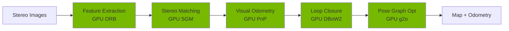

# Chapter 13: Isaac ROS and Hardware-Accelerated SLAM

## Learning Objectives

By the end of this chapter, you will be able to:

- **Install** Isaac ROS packages on Ubuntu 22.04 and Jetson  
- **Understand** GX Framework (GXF) for GPU-accelerated pipelines
- **Configure** Isaac ROS Visual SLAM with stereo cameras
- **Process** stereo depth images on GPU with TensorRT
- **Visualize** SLAM output in RViz2 with odometry and maps
- **Deploy** perception stack to NVIDIA Jetson Orin Nano
- **Benchmark** GPU vs CPU performance for perception tasks

**Prerequisites**: Chapters 11-12 (Isaac ecosystem, ROS 2 knowledge)  
**Hardware**: RTX GPU (development), Jetson Orin Nano (deployment)  
**Estimated Time**: 90 minutes

---

## What is Isaac ROS?

**Isaac ROS** is a collection of GPU-accelerated ROS 2 packages for robotics perception, built on **NVIDIA GXF** (Graph Execution Framework).

### Why GPU Acceleration Matters

**CPU-Based Perception** (traditional ROS 2):
- Stereo depth: 5-10 FPS
- Object detection: 10-15 FPS  
- Visual SLAM: 15-20 FPS

**GPU-Based Perception** (Isaac ROS):
- Stereo depth: **60+ FPS** (12x faster)
- Object detection: **90+ FPS** (6x faster)
- Visual SLAM: **120+ FPS** (6x faster)

:::tip Real-Time Perception
GPU acceleration enables **real-time** perception at high frame rates, critical for fast-moving autonomous robots.
:::

---

## Isaac ROS Architecture

```mermaid
graph TD
    A[Camera Data] --> B[Isaac ROS Nodes]
    B --> C[GXF Graph Executor]
    C --> D[GPU Kernels<br/>CUDA/TensorRT]
    D --> E[Processed Output]
    E --> F[ROS 2 Topics]
    
    F --> G[/visual_slam/tracking/odometry]
    F --> H[/depth/image]
    F --> I[/detections]
    
    style D fill:#76B900
    style F fill:#F4A261
```

### Key Components

1. **GXF (Graph Execution Framework)**
   - Nvidia's framework for heterogeneous computing
   - Pipelines with CPU and GPU "codelets"
   - Optimized scheduling and memory management

2. **ROS 2 Bridge**
   - Converts ROS 2 messages to GXF entities
   - Zero-copy where possible (reduces latency)

3. **GPU-Accelerated Algorithms**
   - Visual SLAM: cuVSLAM
   - Stereo Depth: SGM (Semi-Global Matching)
   - Object Detection: TensorRT-optimized DNNs

---

## Installation

### System Requirements

**Development Machine**:
- Ubuntu 22.04 LTS
- ROS 2 Humble
- NVIDIA RTX GPU (2070+)
- CUDA 12.0+
- Docker (recommended)

**Deployment Target**:
- Jetson Orin Nano/NX
- JetPack 6.0+

---

### Method 1: Docker Installation (Recommended)

**Install NVIDIA Container Toolkit**:

```bash
# Add NVIDIA Docker repo
distribution=$(. /etc/os-release;echo $ID$VERSION_ID)
curl -s -L https://nvidia.github.io/nvidia-docker/gpgkey | sudo apt-key add -
curl -s -L https://nvidia.github.io/nvidia-docker/$distribution/nvidia-docker.list | \
  sudo tee /etc/apt/sources.list.d/nvidia-docker.list

# Install
sudo apt-get update
sudo apt-get install -y nvidia-container-toolkit

# Restart Docker
sudo systemctl restart docker
```

**Pull Isaac ROS Docker Image**:

```bash
# Clone Isaac ROS common
cd ~/workspaces
git clone https://github.com/NVIDIA-ISAAC-ROS/isaac_ros_common.git

# Build and run Docker container
cd isaac_ros_common
./scripts/run_dev.sh ~/workspaces
```

**Inside Container**:

```bash
# Install Isaac ROS Visual SLAM
cd /workspaces
git clone https://github.com/NVIDIA-ISAAC-ROS/isaac_ros_visual_slam.git

# Build
cd /workspaces/isaac_ros_visual_slam
colcon build --packages-up-to isaac_ros_visual_slam

# Source
source install/setup.bash
```

---

### Method 2: Native Installation

```bash
# Install dependencies
sudo apt-get install -y \
  ros-humble-vision-msgs \
  ros-humble-sensor-msgs \
  ros-humble-tf2-ros

# Clone Isaac ROS
mkdir -p ~/ros2_ws/src
cd ~/ros2_ws/src

git clone https://github.com/NVIDIA-ISAAC-ROS/isaac_ros_visual_slam.git
git clone https://github.com/NVIDIA-ISAAC-ROS/isaac_ros_common.git

# Install rosdep dependencies
cd ~/ros2_ws
rosdep install --from-paths src --ignore-src -r -y

# Build
colcon build --packages-select isaac_ros_visual_slam

# Source
source install/setup.bash
```

---

## Understanding Visual SLAM

**Visual SLAM** (Simultaneous Localization and Mapping) estimates robot pose while building a map using only camera data.

### cuVSLAM Algorithm

Isaac ROS uses **cuVSLAM** (CUDA Visual SLAM):



**Advantages**:
- Entire pipeline on GPU (no CPU/GPU transfers)
- 120+ FPS on RTX 4070
- Low latency (<10ms)

---

## Configuring Isaac ROS Visual SLAM

### Camera Setup: Stereo Pair

**Hardware Options**:
- **Intel RealSense D435i**: Built-in stereo ($200)
- **ZED 2**: High-quality stereo ($450)
- **Custom Stereo Rig**: Two identical cameras

**Key Parameters**:
- **Baseline**: Distance between cameras (wider = better depth range)
- **Calibration**: Intrinsic + extrinsic parameters
- **Resolution**: 640x480 (balance speed/accuracy)
- **Frame Rate**: 30 FPS minimum

---

### Launch File Configuration

Create `isaac_slam_stereo.launch.py`:

```python
from launch import LaunchDescription
from launch_ros.actions import Node
from launch.actions import IncludeLaunchDescription
from launch.launch_description_sources import PythonLaunchDescriptionSource
from ament_index_python.packages import get_package_share_directory
import os

def generate_launch_description():
    
    # Launch camera (RealSense example)
    realsense_launch = IncludeLaunchDescription(
        PythonLaunchDescriptionSource([
            os.path.join(
                get_package_share_directory('realsense2_camera'),
                'launch', 'rs_launch.py'
            )
        ]),
        launch_arguments={
            'enable_infra1': 'true',
            'enable_infra2': 'true',
            'enable_depth': 'true',
            'depth_module.profile': '640x480x30'
        }.items()
    )
    
    # Isaac ROS Visual SLAM node
    visual_slam_node = Node(
        package='isaac_ros_visual_slam',
        executable='isaac_ros_visual_slam',
        name='visual_slam',
        parameters=[{
            'denoise_input_images': True,
            'rectified_images': True,
            'enable_debug_mode': False,
            'debug_dump_path': '/tmp/cuvslam',
            'enable_slam_visualization': True,
            'enable_landmarks_view': True,
            'enable_observations_view': True,
            'map_frame': 'map',
            'odom_frame': 'odom',
            'base_frame': 'base_link',
            'input_left_camera_frame': 'camera_infra1_frame',
            'input_right_camera_frame': 'camera_infra2_frame',
            'min_num_images': 30,  # Minimum for initialization
            'img_jitter_threshold_ms': 22.0
        }],
        remappings=[
            ('stereo_camera/left/image', '/camera/infra1/image_rect_raw'),
            ('stereo_camera/left/camera_info', '/camera/infra1/camera_info'),
            ('stereo_camera/right/image', '/camera/infra2/image_rect_raw'),
            ('stereo_camera/right/camera_info', '/camera/infra2/camera_info')
        ]
    )
    
    return LaunchDescription([
        realsense_launch,
        visual_slam_node
    ])
```

**Launch**:

```bash
ros2 launch my_isaac_slam isaac_slam_stereo.launch.py
```

---

### Calibration

**Requirement**: Accurate stereo calibration for good depth estimation.

**Using camera_calibration package**:

```bash
# Install calibration tool
sudo apt install ros-humble-camera-calibration

# Run calibration (print checkerboard pattern)
ros2 run camera_calibration cameracalibrator \
  --size 8x6 \
  --square 0.025 \
  --ros-args \
  -r image:=/camera/infra1/image_raw \
  -r camera:=/camera/infra1

# Move checkerboard for various poses
# Click "Calibrate" when X,Y,Size,Skew bars fill
# Click "Save" to export calibration
```

**Result**: `camera_info.yaml` with calibration parameters

---

## GPU-Accelerated Stereo Depth

### Stereo Disparity Matching

**Semi-Global Matching (SGM)** on GPU:

```python
# Launch stereo disparity node
from launch_ros.actions import Node

disparity_node = Node(
    package='isaac_ros_stereo_image_proc',
    executable='disparity_node',
    name='disparity',
    parameters=[{
        'backends': 'CUDA',  # Use GPU
        'window_size': 5,
        'min_disparity': 0,
        'max_disparity': 64,
        'uniqueness_ratio': 15,
        'P1': 8,
        'P2': 109
    }],
    remappings=[
        ('left/image_rect', '/camera/infra1/image_rect_raw'),
        ('left/camera_info', '/camera/infra1/camera_info'),
        ('right/image_rect', '/camera/infra2/image_rect_raw'),
        ('right/camera_info', '/camera/infra2/camera_info')
    ]
)
```

**Output Topics**:
- `/disparity`: DisparityImage message
- `/depth/image`: Float32 depth map (meters)
- `/depth/points`: PointCloud2

---

### Point Cloud Generation

```python
# Convert disparity to point cloud
from sensor_msgs.msg import PointCloud2
import rclpy
from rclpy.node import Node

class DepthToPointCloud(Node):
    def __init__(self):
        super().__init__('depth_to_pointcloud')
        
        self.sub = self.create_subscription(
            DisparityImage,
            '/disparity',
            self.disparity_callback,
            10
        )
        
        self.pub = self.create_publisher(PointCloud2, '/depth/points', 10)
    
    def disparity_callback(self, msg):
        # GPU-accelerated conversion (handled by Isaac ROS)
        # Point cloud automatically published
        pass
```

**Visualize in RViz2**:
```bash
rviz2
# Add PointCloud2 display
# Topic: /depth/points
# Fixed Frame: camera_link
```

---

## Visualizing SLAM in RViz2

### Complete RViz Configuration

**Topics to Visualize**:

1. **Odometry** (`/visual_slam/tracking/odometry`):
   - Add → Odometry
   - Covariance: Position + Orientation
   - Keep: 100

2. **Map Points** (`/visual_slam/vis/landmarks_cloud`):
   - Add → PointCloud2
   - Color: White
   - Size: 0.02

3. **Camera Frustum** (`/visual_slam/vis/loop_closure_cloud`):
   - Add → Camera
   - Image Topic: /camera/infra1/image_rect_raw

4. **TF Tree**:
   - Add → TF
   - Show Names: true
   - Frames: map, odom, base_link, camera_link

---

### Save RViz Config

```yaml
# slam_visualization.rviz
Panels:
  - Class: rviz_common/Displays
    
Visualization Manager:
  Global Options:
    Fixed Frame: map
    
  Displays:
    - Class: rviz_default_plugins/Odometry
      Topic: /visual_slam/tracking/odometry
      Keep: 100
      Color: 255; 0; 0
      
    - Class: rviz_default_plugins/PointCloud2
      Topic: /visual_slam/vis/landmarks_cloud
      Size: 0.02
      Color Transformer: FlatColor
      Color: 255; 255; 255
      
    - Class: rviz_default_plugins/TF
      Show Names: true
      Marker Scale: 0.3
```

**Load**:
```bash
rviz2 -d slam_visualization.rviz
```

---

## Performance Benchmarking

### GPU vs CPU Comparison

**Benchmark Script**:

```python
import rclpy
from rclpy.node import Node
from sensor_msgs.msg import Image
import time

class PerformanceBenchmark(Node):
    def __init__(self):
        super().__init__('perf_benchmark')
        
        self.frame_times = []
        self.last_time = time.time()
        
        self.sub = self.create_subscription(
            Image,
            '/visual_slam/tracking/slam_image',
            self.callback,
            10
        )
        
        self.timer = self.create_timer(5.0, self.report_fps)
    
    def callback(self, msg):
        now = time.time()
        frame_time = now - self.last_time
        self.frame_times.append(frame_time)
        self.last_time = now
    
    def report_fps(self):
        if len(self.frame_times) > 0:
            avg_fps = 1.0 / (sum(self.frame_times) / len(self.frame_times))
            self.get_logger().info(f'Average FPS: {avg_fps:.1f}')
            self.frame_times = []

def main():
    rclpy.init()
    node = PerformanceBenchmark()
    rclpy.spin(node)
    
if __name__ == '__main__':
    main()
```

**Expected Results**:

| Hardware | Visual SLAM FPS | Stereo Depth FPS |
|----------|----------------|------------------|
| i7-12700 (CPU only) | 15-20 | 5-10 |
| RTX 4070 (GPU) | 100-120 | 60-90 |
| Jetson Orin Nano | 40-60 | 30-45 |

---

## Deploying to Jetson Orin Nano

### JetPack Installation

**Flash Jetson with JetPack 6.0**:

1. Download SDK Manager: https://developer.nvidia.com/sdk-manager
2. Connect Jetson via USB-C (recovery mode)
3. Flash JetPack 6.0 with all components
4. Wait ~30 minutes

---

### Isaac ROS on Jetson

**On Jetson Device**:

```bash
# Install ROS 2 Humble
sudo apt install software-properties-common
sudo add-apt-repository universe
sudo apt update && sudo apt install curl -y
sudo curl -sSL https://raw.githubusercontent.com/ros/rosdistro/master/ros.asc | \
  sudo apt-key add -

sudo sh -c 'echo "deb [arch=$(dpkg --print-architecture)] \
  http://packages.ros.org/ros2/ubuntu $(lsb_release -cs) main" > \
  /etc/apt/sources.list.d/ros2-latest.list'

sudo apt update
sudo apt install ros-humble-desktop

# Clone Isaac ROS
mkdir -p ~/ros2_ws/src
cd ~/ros2_ws/src
git clone --branch release-3.0 https://github.com/NVIDIA-ISAAC-ROS/isaac_ros_visual_slam.git

# Build (use swap if low memory)
cd ~/ros2_ws
colcon build --packages-select isaac_ros_visual_slam --executor sequential

# Source
source install/setup.bash
```

---

### Deploy SLAM Pipeline

**Launch on Jetson**:

```bash
# Connect RealSense camera to Jetson USB 3.0

# Launch SLAM
ros2 launch my_package isaac_slam_jetson.launch.py
```

**Monitor Performance**:

```bash
# Check GPU usage
tegrastats

# Check topic rates
ros2 topic hz /visual_slam/tracking/odometry

# Expected: 40-60 Hz
```

---

## Integration with Navigation

### Publishing Odometry to TF

Isaac ROS Visual SLAM automatically publishes TF:

**TF Tree**:
```
map
  └── odom
       └── base_link
            └── camera_link
```

**Verify**:
```bash
ros2 run tf2_tools view_frames

# Generates frames.pdf showing TF tree
```

---

### Using SLAM with Nav2

**Configuration** (in `nav2_params.yaml`):

```yaml
amcl:
  ros__parameters:
    use_sim_time: false
    robot_model_type: "nav2_amcl::OmniMotionModel"
    odom_frame_id: "odom"  # Provided by Visual SLAM
    base_frame_id: "base_link"
    global_frame_id: "map"
    
slam_toolbox:
  ros__parameters:
    odom_frame: odom  # Isaac Visual SLAM provides this
    map_frame: map
    base_frame: base_link
```

**Launch Nav2 with Isaac SLAM**:

```bash
# Terminal 1: Isaac SLAM
ros2 launch my_package isaac_slam.launch.py

# Terminal 2: Nav2
ros2 launch nav2_bringup navigation_launch.py \
  params_file:=nav2_params.yaml
```

---

## Troubleshooting

### Issue 1: SLAM Not Initializing

**Symptom**: `/visual_slam/status` shows `NOT_INITIALIZED`

**Solutions**:
- Move camera with translation (not just rotation)
- Ensure sufficient visual features (textured environment)
- Check min_num_images parameter (reduce to 20 if struggling)

---

### Issue 2: Poor Tracking

**Symptom**: Frequent tracking losses, jittery odometry

**Solutions**:
- Improve lighting (avoid over/under exposure)
- Reduce motion speed
- Increase camera framerate
- Enable `denoise_input_images: true`

---

### Issue 3: High Latency

**Check Pipeline Latency**:

```python
from diagnostic_msgs.msg import DiagnosticArray

class LatencyMonitor(Node):
    def __init__(self):
        super().__init__('latency_monitor')
        self.sub = self.create_subscription(
            DiagnosticArray,
            '/diagnostics',
            self.callback,
            10
        )
    
    def callback(self, msg):
        for status in msg.status:
            if 'visual_slam' in status.name:
                for kv in status.values:
                    if kv.key == 'latency_ms':
                        self.get_logger().info(f'SLAM latency: {kv.value} ms')
```

**Target**: <20ms on RTX GPU, <50ms on Jetson

---

## Summary

### 🎯 Key Takeaways

- **Isaac ROS** provides GPU-accelerated perception for ROS 2
- **cuVSLAM** achieves 100+ FPS Visual SLAM on RTX GPUs
- **GXF** framework enables heterogeneous CPU/GPU pipelines
- **Stereo depth** processes at 60+ FPS on GPU vs 5-10 FPS on CPU
- **Jetson deployment** brings GPU acceleration to robot edge devices
- **RViz2 visualization** shows odometry, map points, and TF tree
- **Nav2 integration** uses SLAM odometry for autonomous navigation

---

## Hands-On Exercise

### Task: Deploy Visual SLAM Pipeline

**Requirements**:
1. Set up Isaac ROS Visual SLAM with RealSense D435i
2. Configure launch file with proper camera remappings
3. Calibrate stereo camera
4. Run SLAM and walk robot/camera through environment
5. Visualize in RViz2 (odometry + map points)
6. Benchmark FPS on your GPU
7. (Optional) Deploy to Jetson Orin Nano

**Success Criteria**:
- SLAM initializes within 10 seconds
- Odometry published at >30 Hz
- Map contains 1000+ landmark points
- No tracking losses during 2-minute test
- RViz shows consistent TF tree

**Estimated Time**: 75 minutes

---

## Further Resources

### Official Documentation
- 📘 [Isaac ROS Docs](https://nvidia-isaac-ros.github.io/) - Complete API reference
- 🎥 [Isaac ROS Tutorials](https://github.com/NVIDIA-ISAAC-ROS/isaac_ros_visual_slam/blob/main/README.md) - Examples
- 🔧 [GXF Documentation](https://docs.nvidia.com/metropolis/deepstream/dev-guide/graphtools-docs/docs/text/GraphComposer.html) - Advanced

### Community
- 💬 [NVIDIA Forums - Isaac ROS](https://forums.developer.nvidia.com/c/isaac-ros/69) - Support
- 💬 [GitHub Issues](https://github.com/NVIDIA-ISAAC-ROS/isaac_ros_visual_slam/issues) - Bug reports

---

## What's Next?

In **Chapter 14**, you'll configure **Nav2 for Bipedal Navigation**:
- Nav2 architecture for humanoid footstep planning
- Costmap configuration for bipedal footprint
- Behavior trees for walking behaviors
- Recovery behaviors for legged robots
- Integration with Isaac ROS Visual SLAM

**Get ready to make your humanoid navigate autonomously!** 🚀🦿

---

:::note Chapter Completion
✅ You've completed Chapter 13: Isaac ROS and Hardware-Accelerated SLAM  
⏱️ Estimated time to complete: 90 minutes  
📊 Progress: Module 3 - Chapter 3 of 5
:::
