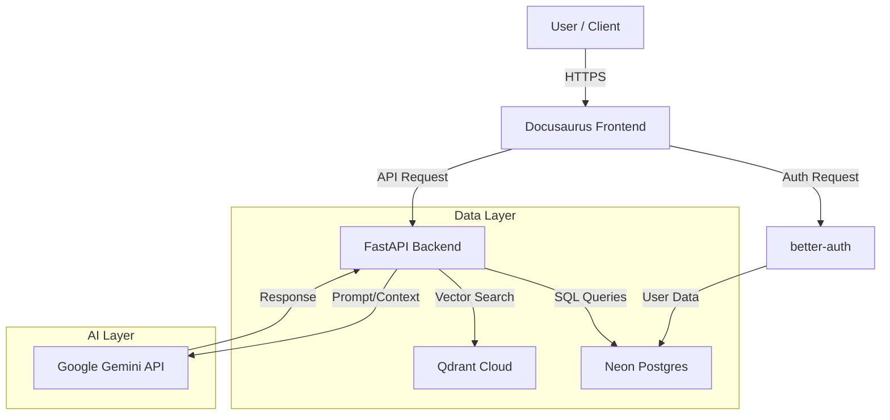

# Specification: AI-Powered Textbook Platform

## 1. Executive Summary

This specification defines the technical architecture for the "Physical AI & Humanoid Robotics" textbook platform. The goal is to transform the static Docusaurus site into an intelligent, interactive learning environment. Key features include a RAG-powered Q&A chatbot, user authentication with profile building, content personalization based on expertise, and real-time Urdu translation.

## 2. Technology Stack

-   **Frontend**: Docusaurus (React/TypeScript)
-   **AI/LLM Engine**: Google Gemini SDK
    -   Embedding Model: `text-embedding-004`
    -   Generation Model: `gemini-2.5-flash`
-   **Backend API**: FastAPI (Python)
-   **Vector Database**: Qdrant Cloud (Free Tier, Vector Size: 768)
-   **Transactional Database**: Neon Serverless Postgres
-   **Authentication**: better-auth.com

## 3. System Architecture

## 4. Feature Requirements

### 4.1. Core: Integrated RAG Chatbot (100 Points)

**User Story**: As a student, I want to ask questions about the textbook content and get accurate answers based *only* on the book material.

**Functional Requirements**:
-   **FR-001**: System must index all Docusaurus MDX content into Qdrant using `text-embedding-004`.
-   **FR-002**: Chat interface available on every page (floating widget).
-   **FR-003**: "Contextual RAG": If user selects text on the page, the query is answered based *only* on that selection + `gemini-2.5-flash` knowledge (bypassing broad Qdrant search).
-   **FR-004**: "Global RAG": If no text selected, query Qdrant (top-k=5), retrieve context, and synthesise answer via Gemini.
-   **FR-005**: Strict System Prompt: "You are a teaching assistant. Answer ONLY based on the provided context. If the answer is not in the context, say 'I don't know'."

### 4.2. Bonus 1: Reusable Intelligence (Agent Skills) (50 Points)

**User Story**: As a developer, I want the AI to have specific tools to handle code and ROS topics accurately.

**Functional Requirements**:
-   **FR-006**: Implement `code_explainer(code_snippet)` tool.
    -   Input: Code string (Python/C++/XML).
    -   Output: Line-by-line explanation and complexity analysis.
-   **FR-007**: Implement `ros_command_lookup(topic_name)` tool.
    -   Input: ROS topic string (e.g., `/cmd_vel`).
    -   Output: Message type (e.g., `geometry_msgs/Twist`) and standard usage.
-   **FR-008**: These tools must be implemented using Gemini Function Calling (or robust prompt engineering equivalent if using Flash).

### 4.3. Bonus 2: Authentication & Profile (50 Points)

**User Story**: As a user, I want to create a profile so the system knows my skill level.

**Functional Requirements**:
-   **FR-009**: Integrate **better-auth** for Email/Password or Social Login.
-   **FR-010**: On Signup, collecting specific metadata:
    -   **Software Level**: Beginner, Intermediate, Advanced (Python/C++).
    -   **Hardware Access**: None (Sim-only), Jetson Nano, Jetson Orin, RTX GPU.
-   **FR-011**: Store this metadata in the `users` table in Neon Postgres.

### 4.4. Bonus 3: Content Personalization (50 Points)

**User Story**: As a beginner, I want complex chapters rewritten simply for me. A master wants deep technical details.

**Functional Requirements**:
-   **FR-012**: "Personalize This Section" button implies frontend.
-   **FR-013**: Backend retrieves user's "Software Level" from Neon.
-   **FR-014**: Calls Gemini with: "Rewrite this section for a {Complete Beginner} focusing on {Core Concepts}."
-   **FR-015**: Stream the rewritten content to the frontend to overlay/replace the original text temporarily.

### 4.5. Bonus 4: Urdu Translation (50 Points)

**User Story**: As a native Urdu speaker, I want to read the technical concepts in my language (Roman Urdu or Script).

**Functional Requirements**:
-   **FR-016**: "Translate to Urdu" button.
-   **FR-017**: Backend sends text to Gemini with prompt: "Translate this technical robotics spec to Urdu. Keep technical terms (ROS, Nodes, Topic) in English but explain the surrounding context in Urdu."

## 5. Data Schemas

### 5.1. Qdrant Collection (`textbook_chunks`)

| Field | Type | Description |
|---|---|---|
| `id` | UUID | Unique Chunk ID |
| `vector` | float[768] | Embeddings from `text-embedding-004` |
| `payload.content` | String | The raw text chunk |
| `payload.module` | String | Module Name (e.g., "Module 1") |
| `payload.chapter` | String | Chapter Title |
| `payload.url` | String | Source URL anchor |

### 5.2. Neon Postgres Schema

**Table: `user_profiles`** (Linked to better-auth `user` table)

| Column | Type | Description |
|---|---|---|
| `user_id` | String (PK) | Foreign Key to better-auth User |
| `python_expertise` | Enum | [Beginner, Intermediate, Advanced] |
| `hardware_access` | Enum | [SimOnly, JetsonNano, JetsonOrin, RTX] |
| `preferred_language`| String | Default 'en' |

## 6. API Endpoints (FastAPI)

| Method | Endpoint | Description |
|---|---|---|
| `POST` | `/v1/chat/rag` | Handles general Q&A using Qdrant + Gemini |
| `POST` | `/v1/chat/context` | Handles "Selected Text" Q&A (No Qdrant) |
| `POST` | `/v1/personalize` | Rewrites text based on User Profile |
| `POST` | `/v1/translate` | Translates text to Urdu |
| `GET` | `/v1/profile` | Fetches user hardware/software profile |
| `POST` | `/v1/profile` | Updates user hardware/software profile |

## 7. Success Metrics

1.  **RAG Accuracy**: Chatbot does not hallucinate facts outside the book.
2.  **Latency**: RAG responses < 3 seconds; Translation < 2 seconds.
3.  **Persistence**: User profile settings persist across sessions via Neon.
4.  **Integration**: Docusaurus frontend communicates seamlessly with FastAPI backend.
